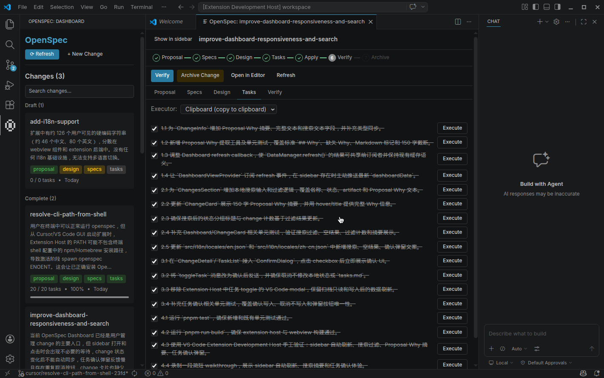
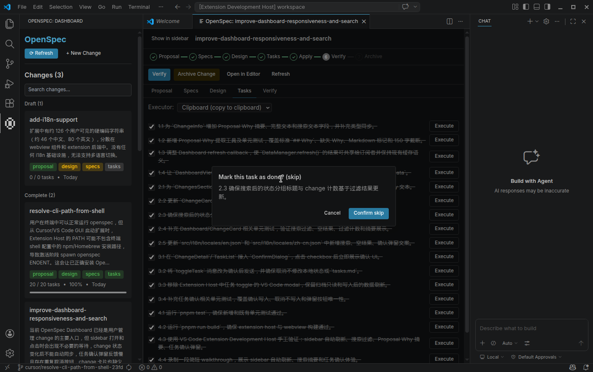

# OpenSpec 扩展

> 面向 VS Code / Cursor 的 OpenSpec 可视化工作流管理界面。

[English](README.md) | 简体中文

## 概览

OpenSpec 扩展为 [OpenSpec](https://github.com/Fission-AI/OpenSpec) 提供可视化 Dashboard，让你无需离开编辑器即可管理 changes、查看 specs、推进 tasks 和执行 OpenSpec 工作流。

### 功能特性

- **可视化 Dashboard**：按状态分组展示 changes，支持进度条、Proposal Why 摘要和搜索
- **Change 详情**：Proposal、Specs、Design、Tasks、Verify 标签页；Markdown 渲染；任务执行入口
- **CLI 集成**：集成 OpenSpec CLI（list、status、new、archive），支持重试、超时和 `openspec.cliPath` 兜底
- **快捷操作**：Continue、FF、Apply、Verify、Archive、Open in Editor、Refresh
- **命令面板**：Open Dashboard、Refresh Data、Create New Change、Archive Change
- **日志输出**：Output 面板中的 `OpenSpec` channel

## 截图

### Dashboard 侧边栏

侧边栏展示按状态分组的 changes、搜索框、任务进度、artifact badges 和 Proposal Why 摘要。

### Change 详情与任务确认

Change 详情页提供工作流操作、artifact tabs、任务执行入口，以及修改任务完成状态前的 webview 确认框。

## 安装

- **从扩展市场安装**：在 [VS Code Marketplace](https://marketplace.visualstudio.com/) 或 [Open VSX](https://open-vsx.org/)（例如 Cursor）安装 **OpenSpec**。
- **运行要求**：[OpenSpec CLI](https://github.com/Fission-AI/OpenSpec#quick-start)；工作区需要包含（或准备包含）`openspec/config.yaml`。扩展会在检测到 OpenSpec workspace 时激活。

如果 Cursor 或 VS Code 无法找到你终端里可用的 OpenSpec CLI，请将 `openspec.cliPath` 设置为 CLI 的绝对路径，例如 `/opt/homebrew/bin/openspec` 或 `/usr/local/bin/openspec`。

## 使用

### 快速开始

1. 打开包含 `openspec/config.yaml` 的工作区。
2. 打开命令面板（macOS: `Cmd+Shift+P`；Windows/Linux: `Ctrl+Shift+P`）。
3. 执行 **OpenSpec: Open Dashboard**。
4. 选择一个 change，查看 Proposal、Specs、Design、Tasks、Verify 标签页。
5. 使用 action bar 或 change card 的快捷操作复制/填充 `/opsx:continue`、`/opsx:ff`、`/opsx:apply`、`/opsx:verify` 命令。

### 命令

在命令面板中输入 OpenSpec：

| 命令 | 说明 |
|---|---|
| **OpenSpec: Open Dashboard** | 打开可视化 Dashboard（侧边栏或编辑区） |
| **OpenSpec: Refresh Data** | 从 CLI 手动刷新数据 |
| **OpenSpec: Create New Change** | 创建新的 change（带校验） |
| **OpenSpec: Archive Change** | 归档已完成的 change |

### 快捷键

- `Cmd+Shift+P`（macOS）/ `Ctrl+Shift+P`（Windows/Linux）：打开命令面板，然后输入 OpenSpec 执行命令。
- 默认不绑定快捷键；你可以在 Keyboard Shortcuts 中自行绑定，例如绑定 `OpenSpec: Open Dashboard`。

### 配置

| 设置项 | 默认值 | 说明 |
|---|---:|---|
| `openspec.focusSidebarViewWhenOpeningChangeDetail` | `false` | 打开 change 详情时聚焦 OpenSpec sidebar |
| `openspec.focusSidebarViewWhenOpeningDashboard` | `false` | 执行 Open Dashboard 命令时聚焦 OpenSpec sidebar |
| `openspec.cliPath` | `""` | 可选的 OpenSpec CLI 绝对路径；为空时自动从 PATH 和 login shell 检测 |
| `openspec.taskExecutionMode` | `fillChat` | 点击任务执行时的模式：`auto` 通过 adapter 执行；`fillChat` 填充 chat 或复制到剪贴板 |
| `openspec.preferredAgentAdapter` | `""` | 首选执行适配器 id，例如 `cursor`、`clipboard`；为空时使用第一个可用适配器 |
| `openspec.taskDependencyPolicy` | `block` | 前置任务未完成时的策略：`block` 阻止执行；`warn` 提示后允许继续 |
| `openspec.agentModel` | `auto` | Cursor agent CLI 模型；`auto` 表示由 Cursor 选择 |
| `openspec.debug` | `false` | 启用 debug：显示 Verify tab，并在 Output 中打印完整 prompt |

### 任务执行与适配器

- **Clipboard** (`clipboard`)：始终可用。`fillChat` 模式复制 prompt 到剪贴板；`auto` 模式也会复制，不直接执行。
- **Cursor** (`cursor`)：当 Cursor `agent` CLI 在 PATH 中可用时启用。可通过 agent CLI 执行任务，也可填充 chat / 复制到剪贴板。
- 可在 change 详情页的 Adapter 下拉框选择适配器，或通过 `openspec.preferredAgentAdapter` 设置。若选中的适配器不可用，扩展会回退到第一个可用适配器（通常是 Clipboard）。

### Dashboard

- 按 change 名称、状态、artifact 或 Proposal Why 文本搜索。
- 在侧边栏查看进度、状态、artifact badges 和 Proposal Why 摘要。
- 打开 change 详情页查看 Proposal / Specs / Design / Tasks / Verify。
- 通过选定 adapter 执行任务，或将工作流命令填充/复制到 chat。
- 修改任务完成状态前会先显示 webview 确认框。

### 查看日志

1. 打开 Output 面板：`View > Output` 或 `Cmd+Shift+U`。
2. 在下拉框中选择 **OpenSpec**。
3. 查看 INFO、WARN、ERROR、DEBUG 等时间戳日志。

### 故障排查

- **扩展未激活**：确认打开的文件夹包含（或准备包含）OpenSpec workspace：`openspec/config.yaml`。
- **提示 OpenSpec CLI not found**：安装 [OpenSpec CLI](https://github.com/Fission-AI/OpenSpec#quick-start)，并确保它在 PATH 中；如果终端可用但扩展不可用，请配置 `openspec.cliPath`。
- **Dashboard 为空**：执行 **OpenSpec: Refresh Data**，并检查 Output 面板中的 **OpenSpec** 日志。
