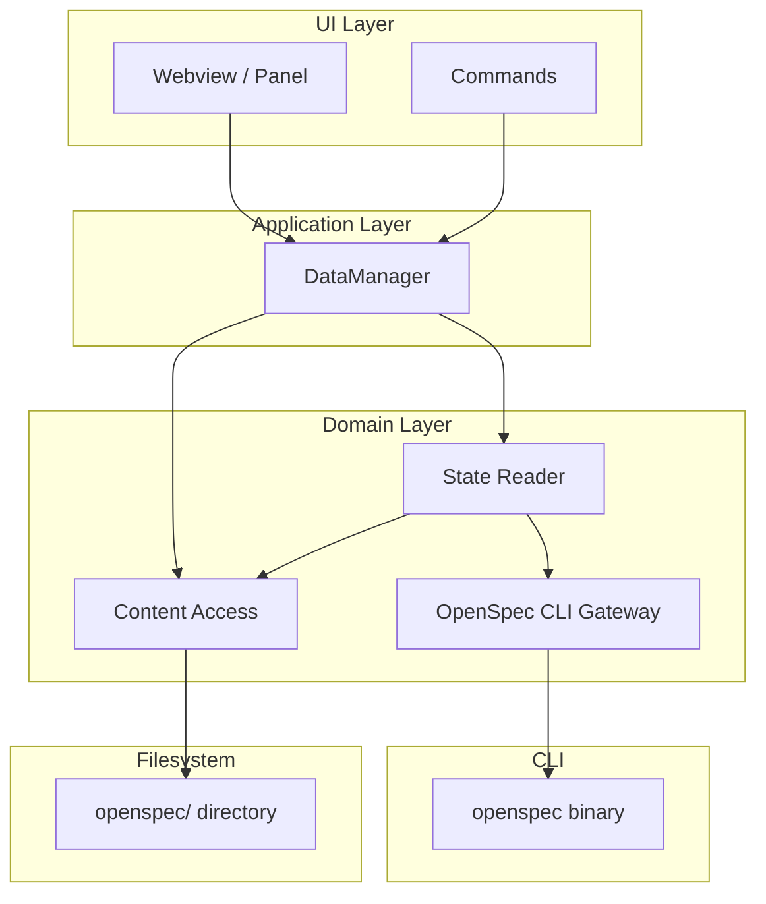
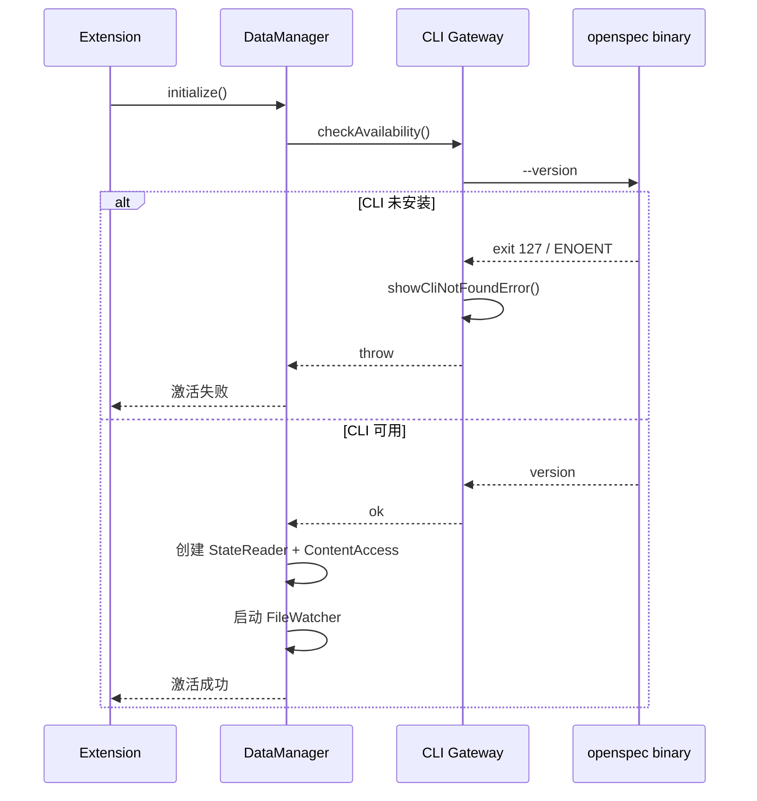

# OpenSpec VSCode Extension - 架构设计

## 项目概述

这是一个专为 OpenSpec 设计的 VSCode 插件，提供可视化的工作流操作界面。

## 核心决策

1. **独立项目**：不依赖于 OpenSpec 核心仓库，作为独立插件发布
2. **数据源（CLI 优先）**：工程所需**状态**以 OpenSpec CLI 为主（list / show / status / instructions 等）；Artifact 正文等 CLI 未提供的能力经 **Content Access** 读写在 `openspec/` 目录完成。本机**未安装** openspec 时仅提示安装，不提供“无 CLI”的降级模式。
3. **技术栈**：React + Tailwind CSS + Radix UI (Frontend) + esbuild (Extension)
4. **四层隔离**：CLI 网关（唯一调用 `openspec` 二进制）→ State Reader（状态聚合）→ Content Access（读写 artifact/任务/归档）→ DataManager（应用门面，对外 API 不变）

## 架构图



（State Reader 聚合 CLI 与 Content Access；Content Access 仅读写 `openspec/` 目录，不直接调 CLI。）

- **OpenSpec CLI Gateway**（`openspecCli.ts`）：唯一 spawn `openspec` 的模块；封装 list / show / status / instructions / validate / new / archive；命令未找到（exit 127 或 spawn ENOENT）时统一提示安装并抛错，不做文件回退。
- **State Reader**（`stateReader.ts`）：提供变更列表、变更详情、任务列表、spec 列表、归档列表等**状态**；优先从 CLI 获取，CLI 不提供的经 Content Access 获取；不直接调 fs。
- **Content Access**（接口 `contentAccess.ts`，默认实现 `fileManager.ts`）：读/写 artifact、任务勾选与父任务自动完成、delta spec、归档列表等；当前基于 `openspec/` 目录，接口抽象便于将来由 CLI 或其它实现替换。
- **DataManager**：应用门面，只依赖 State Reader + Content Access；对外 API 保持不变，供 Webview、Commands、TaskExecutor 使用。

### 未安装 OpenSpec 时的行为

- 扩展激活或执行依赖 CLI 的操作时，Gateway 检测到「命令未找到」（exit 127 或 spawn ENOENT）即调用 `showCliNotFoundError()` 提示安装，并向上抛错。
- 不提供基于纯文件扫描的降级模式，避免展示不完整或与 CLI 不一致的状态。

### CLI 命令与状态映射

| CLI 命令 | 用途 |
|----------|------|
| `list --json` | 变更列表 |
| `status --change <name> --json` | 单 change 进度与 artifacts |
| `show <name> --json` | 变更详情、artifacts、tasks |
| `list --specs --json` | Spec 列表 |
| `instructions <artifact> --change <name> --json` | 执行任务时的 prompt 生成 |
| `validate` / `new` / `archive` | 校验、新建 change、归档 |

| 状态/能力           | 来源（CLI 优先） |
|--------------------|------------------|
| 变更列表 + 进度     | `list` + `status` |
| 变更详情、artifacts | `show name --json` |
| 任务列表（执行/勾选）| `show` 的 tasks 或 Content Access 读 tasks.md |
| Spec 列表          | `list --specs`，空时 Content Access 扫 changes |
| 归档列表           | Content Access 扫 archive 目录（CLI 暂无） |
| Artifact 正文      | Content Access 读文件 |
| 任务勾选/父任务完成 | Content Access 写 tasks.md |
| 新建/归档 change   | CLI `new` / `archive` |

```
┌─────────────────────────────────────────────────────────────────────┐
│                    VSCode Extension Architecture                     │
├─────────────────────────────────────────────────────────────────────┤
│                                                                      │
│  Extension Host (Node.js)                                           │
│  ┌──────────────────────────────────────────────────────────────┐  │
│  │                                                              │  │
│  │  ┌───────────────────────────────────────────────────────┐  │  │
│  │  │  Extension Entry (extension.ts)                       │  │  │
│  │  │  - activate()                                         │  │  │
│  │  │  - registerCommands()                                 │  │  │
│  │  │  - initializeFileWatcher()                            │  │  │
│  │  └──────────────────┬────────────────────────────────────┘  │  │
│  │                     │                                         │  │
│  │                     ▼                                         │  │
│  │  ┌───────────────────────────────────────────────────────┐  │  │
│  │  │  OpenSpec Service Layer                               │  │  │
│  │  │                                                        │  │  │
│  │  │  ┌─────────────────────────────────────────────────┐  │  │  │
│  │  │  │  DataManager (dataManager.ts)                    │  │  │  │
│  │  │  │  - 应用门面，仅依赖 StateReader + ContentAccess  │  │  │  │
│  │  │  └─────────────────────────────────────────────────┘  │  │  │
│  │  │  ┌─────────────────────────────────────────────────┐  │  │  │
│  │  │  │  State Reader (stateReader.ts)                   │  │  │  │
│  │  │  │  - listChanges / getChangeDetails / getTasks     │  │  │  │
│  │  │  │  - listSpecs / listArchivedChanges               │  │  │  │
│  │  │  └─────────────────────────────────────────────────┘  │  │  │
│  │  │  ┌─────────────────────────────────────────────────┐  │  │  │
│  │  │  │  CLI Gateway (openspecCli.ts)                    │  │  │  │
│  │  │  │  - list / show / status / instructions / ...    │  │  │  │
│  │  │  │  - 未安装时 showCliNotFoundError + throw         │  │  │  │
│  │  │  └─────────────────────────────────────────────────┘  │  │  │
│  │  │  ┌─────────────────────────────────────────────────┐  │  │  │
│  │  │  │  Content Access (contentAccess.ts + fileManager) │  │  │  │
│  │  │  │  - readArtifact / readTasks / toggleTask         │  │  │  │
│  │  │  │  - autoCompleteParents / listDeltaSpecIds / ...  │  │  │  │
│  │  │  └─────────────────────────────────────────────────┘  │  │  │
│  │  │  ┌─────────────────────────────────────────────────┐  │  │  │
│  │  │  │  Data Models (types.ts)                          │  │  │  │
│  │  │  └─────────────────────────────────────────────────┘  │  │  │
│  │  └────────────────────────────────────────────────────────┘  │  │
│  │                     │                                         │  │
│  │                     ▼                                         │  │
│  │  ┌───────────────────────────────────────────────────────┐  │  │
│  │  │  Command Registry (commands.ts)                       │  │  │
│  │  │  - openspec.openDashboard                            │  │  │
│  │  │  - openspec.refreshData                              │  │  │
│  │  │  - openspec.newChange                                │  │  │
│  │  │  - openspec.openChange                               │  │  │
│  │  │  - openspec.archiveChange                            │  │  │
│  │  │  - openspec.toggleTask                               │  │  │
│  │  │  - openspec.openSpec                                 │  │  │
│  │  │  - openspec.copyOpsxCommand                          │  │  │
│  │  └────────────┬──────────────────────────────────────────┘  │  │
│  │               │                                              │  │
│  │               ▼                                              │  │
│  │  ┌───────────────────────────────────────────────────────┐  │  │
│  │  │  View Providers                                       │  │  │
│  │  │                                                        │  │  │
│  │  │  ┌────────────────────────────────────────────────┐  │  │  │
│  │  │  │  Dashboard Webview Provider                    │  │  │  │
│  │  │  │  - createWebviewPanel()                        │  │  │  │
│  │  │  │  - handleMessage(msg)                          │  │  │  │
│  │  │  │  - postMessage(data)                           │  │  │  │
│  │  │  └────────────────────────────────────────────────┘  │  │  │
│  │  │                                                        │  │  │
│  │  │  ┌────────────────────────────────────────────────┐  │  │  │
│  │  │  │  Sidebar Tree Provider                         │  │  │  │
│  │  │  │  - getChildren(element): TreeItem[]            │  │  │  │
│  │  │  │  - refresh()                                   │  │  │  │
│  │  │  └────────────────────────────────────────────────┘  │  │  │
│  │  └────────────────────────────────────────────────────────┘  │  │
│  └──────────────────────────────────────────────────────────────┘  │
│                                                                      │
│                     │                                                │
│                     │ Message Passing                               │
│                     ▼                                                │
│                                                                      │
│  Webview (React App)                                                │
│  ┌──────────────────────────────────────────────────────────────┐  │
│  │                                                              │  │
│  │  ┌────────────────────────────────────────────────────────┐ │  │
│  │  │  App.tsx                                               │ │  │
│  │  │  - Router                                              │ │  │
│  │  │  - Message Handler                                     │ │  │
│  │  └──────────────┬─────────────────────────────────────────┘ │  │
│  │                 │                                            │  │
│  │                 ▼                                            │  │
│  │  ┌──────────────────────────────────────────────────────┐  │  │
│  │  │  Views                                                │  │  │
│  │  │                                                        │  │  │
│  │  │  ┌──────────────────────────────────────────────┐    │  │  │
│  │  │  │  Dashboard View (dashboard.tsx)              │    │  │  │
│  │  │  │  ┌────────────────────────────────────────┐  │    │  │  │
│  │  │  │  │  Changes Section                       │  │    │  │  │
│  │  │  │  │  - Draft (no tasks)                    │  │    │  │  │
│  │  │  │  │  - Active (incomplete tasks)           │  │    │  │  │
│  │  │  │  │  - Completed (all tasks done)          │  │    │  │  │
│  │  │  │  └────────────────────────────────────────┘  │    │  │  │
│  │  │  │  ┌────────────────────────────────────────┐  │    │  │  │
│  │  │  │  │  Specs Section                         │  │    │  │  │
│  │  │  │  │  - List all specs with req counts      │  │    │  │  │
│  │  │  │  └────────────────────────────────────────┘  │    │  │  │
│  │  │  │  ┌────────────────────────────────────────┐  │    │  │  │
│  │  │  │  │  Archive Section                       │  │    │  │  │
│  │  │  │  │  - Browse archived changes             │  │    │  │  │
│  │  │  │  └────────────────────────────────────────┘  │    │  │  │
│  │  │  └──────────────────────────────────────────────┘    │  │  │
│  │  │                                                        │  │  │
│  │  │  ┌──────────────────────────────────────────────┐    │  │  │
│  │  │  │  Change Detail View (changeDetail.tsx)       │    │  │  │
│  │  │  │  ┌────────────────────────────────────────┐  │    │  │  │
│  │  │  │  │  Tabs                                  │  │    │  │  │
│  │  │  │  │  - Proposal                            │  │    │  │  │
│  │  │  │  │  - Specs (with delta diff)             │  │    │  │  │
│  │  │  │  │  - Design                              │  │    │  │  │
│  │  │  │  │  - Tasks (interactive checklist)       │  │    │  │  │
│  │  │  │  └────────────────────────────────────────┘  │    │  │  │
│  │  │  │  ┌────────────────────────────────────────┐  │    │  │  │
│  │  │  │  │  Actions                               │  │    │  │  │
│  │  │  │  │  - Copy /opsx:ff                       │  │    │  │  │
│  │  │  │  │  - Copy /opsx:apply                    │  │    │  │  │
│  │  │  │  │  - Archive Change                      │  │    │  │  │
│  │  │  │  └────────────────────────────────────────┘  │    │  │  │
│  │  │  └──────────────────────────────────────────────┘    │  │  │
│  │  │                                                        │  │  │
│  │  │  ┌──────────────────────────────────────────────┐    │  │  │
│  │  │  │  Spec Viewer (specViewer.tsx)                │  │    │  │  │
│  │  │  │  - Render spec requirements                  │  │    │  │  │
│  │  │  │  - Show scenarios                            │  │    │  │  │
│  │  │  └──────────────────────────────────────────────┘    │  │  │
│  │  └────────────────────────────────────────────────────────┘  │  │
│  │                                                              │  │
│  │  ┌────────────────────────────────────────────────────────┐ │  │
│  │  │  Components (Radix UI based)                           │ │  │
│  │  │  - Button, Card, Tabs, Progress, Accordion            │ │  │
│  │  │  - TaskCheckbox (custom)                              │ │  │
│  │  │  - DiffViewer (custom)                                │ │  │
│  │  │  - MarkdownRenderer (with syntax highlight)           │ │  │
│  │  └────────────────────────────────────────────────────────┘ │  │
│  └──────────────────────────────────────────────────────────────┘  │
│                                                                      │
└─────────────────────────────────────────────────────────────────────┘
```

## 数据流

### 初始化流程



1. **Extension Activation**
   - 调用 DataManager.initialize()
   - DataManager 先通过 CLI Gateway 执行 `openspec --version`；若未安装（exit 127 或 spawn 报错），提示安装并抛错，不继续
   - 若 CLI 可用，创建 StateReader（依赖 Gateway + Content Access）、Content Access（默认 FileManager），启动 FileWatcher

2. **Data Loading（CLI 优先）**
   - 变更列表：State Reader → Gateway `list --json` + `status --change <name> --json`
   - 变更详情：State Reader → Gateway `show <name> --json`
   - 任务列表：State Reader 优先用 `show` 的 tasks，若与 UI 不兼容则 Content Access 读 tasks.md
   - Artifact 正文：Content Access 读 `openspec/` 下文件
   - 文件变更时 FileWatcher 触发 refresh，必要时调用 Content Access（如 autoCompleteParents）

3. **UI Initialization**
   - 创建 webview / panel，加载 React 应用，通过 DataManager 获取数据并下发

### 文件监听机制

```
FileSystemWatcher
├─> openspec/changes/**/*.md
│   └─> onChange: refresh change data
├─> openspec/changes/**/.openspec.yaml
│   └─> onChange: refresh change metadata
├─> openspec/specs/**/*.md
│   └─> onChange: refresh spec data
└─> openspec/config.yaml
    └─> onChange: reload config
```

### 任务更新流程

```
User clicks task checkbox in webview
    ↓
Message posted to Extension (webviewMessageHandler)
    ↓
DataManager.toggleTask(changeName, taskIndex)
    ↓
Content Access: toggleTask → autoCompleteParents
    ↓
Write tasks.md（仅 Content Access 层接触 fs）
    ↓
FileSystemWatcher detects change
    ↓
Notify webview to refresh
```

## 项目结构

```
openspec-vscode/
├── package.json
├── tsconfig.json
├── esbuild.config.js
├── vite.config.ts
├── .vscodeignore
├── README.md
├── CHANGELOG.md
│
├── src/
│   ├── extension/              # Extension host code (Node.js)
│   │   ├── extension.ts        # Entry point
│   │   ├── commands.ts         # Command registry
│   │   ├── services/
│   │   │   ├── openspecCli.ts  # CLI wrapper
│   │   │   ├── fileManager.ts  # File operations
│   │   │   └── types.ts        # Data models
│   │   ├── providers/
│   │   │   ├── dashboardProvider.ts  # Webview provider
│   │   │   └── sidebarProvider.ts    # Tree view provider
│   │   └── utils/
│   │       ├── markdown.ts     # Markdown parsing
│   │       └── logger.ts       # Logging
│   │
│   └── webview/                # Webview UI (React)
│       ├── index.tsx           # React entry
│       ├── App.tsx             # Main app component
│       ├── hooks/
│       │   ├── useVscode.ts    # VSCode API hook
│       │   └── useData.ts      # Data fetching hook
│       ├── views/
│       │   ├── Dashboard.tsx
│       │   ├── ChangeDetail.tsx
│       │   └── SpecViewer.tsx
│       ├── components/
│       │   ├── ui/             # Shadcn/Radix components
│       │   ├── TaskCheckbox.tsx
│       │   ├── DiffViewer.tsx
│       │   └── MarkdownRenderer.tsx
│       ├── styles/
│       │   └── globals.css     # Tailwind base
│       └── lib/
│           └── utils.ts        # Utility functions
│
├── assets/
│   ├── icon.png
│   └── icons/
│       └── activity-bar-icon.svg
│
├── dist/                       # Build output
│   ├── extension.js
│   └── webview/
│
└── test/
    ├── suite/
    └── runTest.ts
```

## 开发阶段

### MVP (Phase 1) - 核心功能

**目标**：基本可用的 Dashboard 和任务管理

**功能清单**：

1. ✅ 扩展激活和初始化
2. ✅ CLI 集成（list, show）
3. ✅ Changes Dashboard（查看所有 changes）
4. ✅ Change Detail View（查看 artifacts）
5. ✅ Task Checklist（点击勾选）
6. ✅ Quick Actions（复制命令到剪贴板）
7. ✅ 基础文件监听

**技术任务**：

- [ ] 项目初始化（package.json, tsconfig, build config）
- [ ] Extension 入口和激活
- [ ] OpenSpec CLI Wrapper
- [ ] File System Manager
- [ ] Dashboard Webview Provider
- [ ] React App 基础框架
- [ ] Dashboard View UI
- [ ] Change Detail View UI
- [ ] Task Checkbox 组件
- [ ] Message Passing 机制
- [ ] FileSystemWatcher 集成

**验收标准**：

- 能在 VSCode 中打开 Dashboard
- 能看到所有 changes 及其进度
- 能点击进入 change 查看详情
- 能勾选/取消勾选任务
- 能复制 opsx 命令

---

### Phase 2 - 增强体验

**目标**：更好的导航和可视化

**功能清单**：

1. ✅ Sidebar Tree View
2. ✅ Spec List 和 Viewer
3. ✅ Spec Diff Viewer (delta vs main)
4. ✅ Archive Browser
5. ✅ File Navigation（点击跳转）
6. ✅ 搜索/过滤功能
7. ✅ 进度可视化（图表）

**技术任务**：

- [ ] Sidebar Tree View Provider
- [ ] Spec List API integration
- [ ] Spec Viewer component
- [ ] Diff Viewer component (delta spec vs main spec)
- [ ] Archive API integration
- [ ] Archive Browser UI
- [ ] File navigation commands
- [ ] Search/Filter logic
- [ ] Progress charts (Chart.js or Recharts)

**验收标准**：

- 侧边栏显示 changes/specs 树
- 能查看 spec 内容和 requirements
- 能对比 delta spec 和 main spec 差异
- 能浏览历史 archive
- 点击 artifact 能跳转到文件
- 能搜索 changes/specs

---

### Phase 3 - 高级功能

**目标**：完整的工作流支持

**功能清单**：

1. ✅ Comment System（对 artifact 添加评论）
2. ✅ AI Integration（在插件中触发 AI 命令）
3. ✅ Bulk Operations（批量归档等）
4. ✅ Multi-language Support (i18n)
5. ✅ Settings Panel
6. ✅ 键盘快捷键
7. ✅ 通知和音效

**技术任务**：

- [ ] Comment storage design (JSON in .comments/ ?)
- [ ] Comment UI components
- [ ] AI command integration (need research)
- [ ] Bulk archive flow
- [ ] i18next setup
- [ ] Translation files (en, zh, ja)
- [ ] Settings schema and UI
- [ ] Keyboard shortcuts registration
- [ ] Notification system
- [ ] Sound effects (optional)

**验收标准**：

- 能在 artifact 上添加评论
- 能通过插件触发 AI 工作流
- 能批量归档多个 changes
- 支持中英文界面
- 有完整的设置面板
- 主要操作有快捷键

---

## 技术栈详细清单

### Extension (Node.js)

```json
{
  "engines": { "vscode": "^1.85.0" },
  "dependencies": {
    "@types/vscode": "^1.85.0"
  },
  "devDependencies": {
    "esbuild": "^0.25.0",
    "typescript": "^5.7.3"
  }
}
```

### Webview (React)

```json
{
  "dependencies": {
    "react": "^19.1.1",
    "react-dom": "^19.1.1",
    "@radix-ui/react-accordion": "^1.2.12",
    "@radix-ui/react-tabs": "^1.1.13",
    "@radix-ui/react-progress": "^1.1.7",
    "@radix-ui/react-dropdown-menu": "^2.1.16",
    "@radix-ui/react-select": "^2.2.6",
    "class-variance-authority": "^0.7.1",
    "clsx": "^2.1.1",
    "tailwind-merge": "^2.6.0",
    "lucide-react": "^0.468.0"
  },
  "devDependencies": {
    "@vitejs/plugin-react": "^4.3.4",
    "vite": "^6.0.3",
    "tailwindcss": "^4.0.0",
    "@tailwindcss/vite": "^4.0.0"
  }
}
```

## 关键技术点

### 1. Message Passing between Extension and Webview

**Extension → Webview**:

```typescript
webviewPanel.webview.postMessage({
  type: 'updateData',
  payload: { changes: [...] }
});
```

**Webview → Extension**:

```typescript
vscode.postMessage({
  type: 'toggleTask',
  payload: { changeName: 'add-dark-mode', taskId: '1.2' }
});
```

### 2. CLI 调用封装

```typescript
async function execOpenSpec(args: string[]): Promise<any> {
  return new Promise((resolve, reject) => {
    const proc = spawn('openspec', args);
    let stdout = '';
    let stderr = '';
    
    proc.stdout.on('data', (data) => { stdout += data; });
    proc.stderr.on('data', (data) => { stderr += data; });
    
    proc.on('close', (code) => {
      if (code !== 0) {
        reject(new Error(stderr || `Exit code ${code}`));
      } else {
        try {
          resolve(JSON.parse(stdout));
        } catch {
          resolve(stdout);
        }
      }
    });
  });
}
```

### 3. Tasks Markdown 解析和更新

```typescript
function parseTasksMarkdown(content: string): Task[] {
  const lines = content.split('\n');
  const tasks: Task[] = [];
  
  for (const line of lines) {
    const match = line.match(/^(\s*)- \[([ x])\] (.+)$/);
    if (match) {
      tasks.push({
        indent: match[1].length,
        done: match[2] === 'x',
        text: match[3]
      });
    }
  }
  
  return tasks;
}

function toggleTask(content: string, taskIndex: number): string {
  const lines = content.split('\n');
  let taskCount = -1;
  
  for (let i = 0; i < lines.length; i++) {
    if (/^(\s*)- \[([ x])\]/.test(lines[i])) {
      taskCount++;
      if (taskCount === taskIndex) {
        lines[i] = lines[i].replace(/\[([ x])\]/, (_, char) => {
          return char === 'x' ? '[ ]' : '[x]';
        });
        break;
      }
    }
  }
  
  return lines.join('\n');
}
```

### 4. FileSystemWatcher 配置

```typescript
const watcher = vscode.workspace.createFileSystemWatcher(
  new vscode.RelativePattern(workspaceRoot, 'openspec/**/*.{md,yaml}')
);

watcher.onDidChange((uri) => {
  // Refresh data and notify webview
  refreshData(uri);
});

watcher.onDidCreate((uri) => {
  refreshData(uri);
});

watcher.onDidDelete((uri) => {
  refreshData(uri);
});
```

## 性能优化

1. **懒加载**：只在需要时读取 artifact 内容
2. **缓存**：缓存 CLI 输出，文件变化时才重新读取
3. **防抖**：文件监听事件 debounce 300ms
4. **虚拟滚动**：Archive 列表很长时使用虚拟滚动

## 测试策略

1. **Unit Tests**：CLI wrapper, markdown parsing
2. **Integration Tests**：Extension commands
3. **E2E Tests**：通过 VSCode Extension Test API
4. **Manual Testing**：实际工作流验证

## 发布

1. **VSCode Marketplace**：发布为官方扩展
2. **版本策略**：跟随 OpenSpec 版本
3. **更新日志**：在 CHANGELOG.md 中记录
4. **文档**：在 README 中提供详细使用说明

## 后续规划

- MCP Integration（如果 OpenSpec 支持 MCP）
- GitHub Integration（查看 PR 关联的 changes）
- Team Collaboration（多人协作功能）
- Analytics（使用统计）
