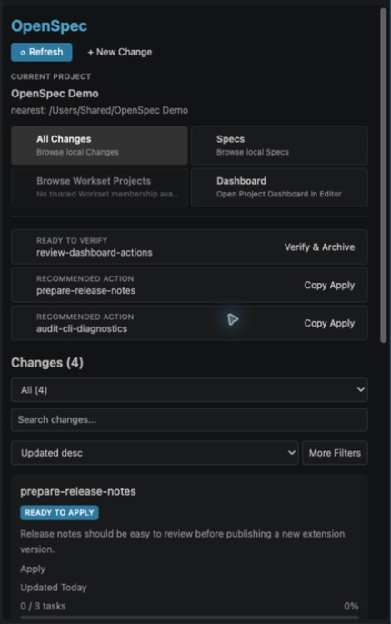
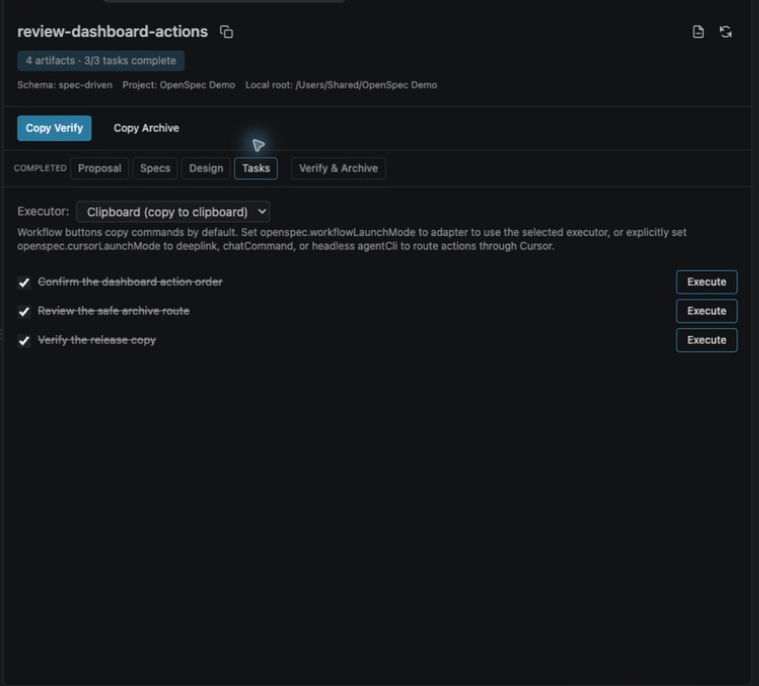
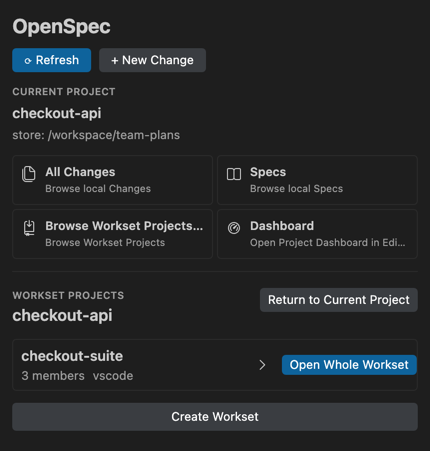
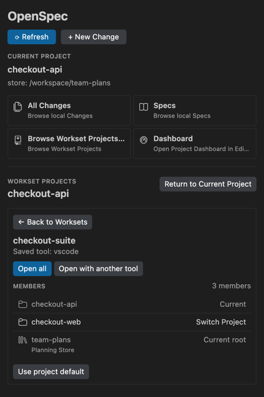
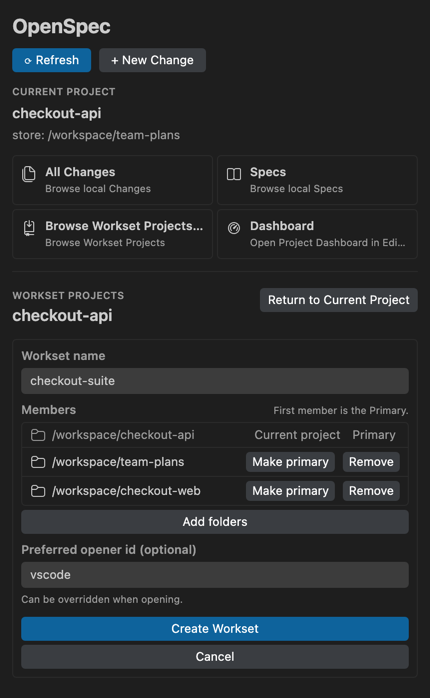

# OpenSpec Extension User Guide

English | [简体中文](USER_GUIDE.zh-CN.md)

This guide explains how the OpenSpec extension UI works with OpenSpec. For the full OpenSpec model, start with the official [Getting Started guide](https://github.com/Fission-AI/OpenSpec/blob/main/docs/getting-started.md) and [command guide](https://github.com/Fission-AI/OpenSpec/blob/main/docs/how-commands-work.md).

## Choose your path

- **New to OpenSpec:** continue with [Install and initialize](#install-and-initialize).
- **Already use OpenSpec:** jump to [Plugin interface](#plugin-interface).
- **Here for multi-repository work:** jump to [Stores and Worksets](#stores-and-worksets).

## Install and initialize

1. Install the OpenSpec CLI and confirm `openspec --version` works in the terminal opened by your editor.
2. Run `openspec init` in the repository that will own local Changes and Specs.
3. Open that repository in VS Code or Cursor.
4. Install and enable the OpenSpec extension.
5. Run **OpenSpec: Open Dashboard** from the Command Palette.

The extension activates for workspace folders containing `openspec/config.yaml`. If the editor cannot find a CLI that works in your shell, set `openspec.cliPath` to the executable's absolute path. To use Verify and Review & Archive, also ensure the Cursor Agent CLI `agent` executable is available.

## Complete your first Change

1. Check the Root control before creating anything. It decides where the Change and Specs are read and written.
2. Select **New Change**, enter a kebab-case name, and create the Change skeleton.
3. In the default Clipboard mode, select **Copy Continue planning** for the next artifact or **Copy FF** for the remaining planning artifacts. Both actions only copy the command; paste it to your Agent. After you configure an adapter launch mode, the buttons use Open, Launch, or Run variants to pass the action directly to that adapter.
4. Open the Change and review Proposal, Specs, Design, and Tasks.
5. In the default Clipboard mode, select **Copy Apply**, then paste the command to your Agent. With an adapter launch mode configured, the corresponding action launches or runs through that adapter.
6. Open **Verify & Archive** and select **Run Verify** to start the interactive terminal.
7. Use **Review & Archive** for the normal Agent-assisted archive path. Use **Archive Now** only when you intentionally want the confirmation-protected direct CLI path.

### Lifecycle states

| State | Meaning | Typical next action |
|---|---|---|
| Planning | Required artifacts are still being produced | Continue or Fast-forward |
| Ready to Apply | Planning artifacts are complete | Apply |
| Applying | Implementation tasks are in progress | Continue implementation |
| Ready to Verify | Required tasks are complete | Verify |
| Archived | The Change is read-only history | Inspect artifacts or verification output |

## Plugin interface

| Surface | What it is for |
|---|---|
| OpenSpec Root control | Chooses the local Project root or registered Store that owns Changes and Specs |
| Project navigation | Chooses which Project the sidebar is displaying |
| Dashboard | Filters Changes by lifecycle and presents recommended next actions |
| Change detail | Reviews Proposal, Specs, Design, Tasks, and Verify & Archive |
| Worksets | Lists machine-local groups containing the current Project and opens their detail/create flows |

### UI action and command mapping

| UI action | Underlying action | Where it runs | Result |
|---|---|---|---|
| New Change | `openspec new change <name>` | Extension CLI invocation | Creates a Change skeleton in the selected Root |
| Copy Continue planning (default) | `/opsx:continue <change>` (Clipboard, Copilot, Claude Code) or `/opsx-continue <change>` (Cursor, OpenCode) | Clipboard by default; configured Agent adapter after launch mode setup | Copies the next-artifact command by default; a configured adapter can launch or run it |
| Copy FF (default) | `/opsx:ff <change>` (Clipboard, Copilot, Claude Code) or `/opsx-ff <change>` (Cursor, OpenCode) | Clipboard by default; configured Agent adapter after launch mode setup | Copies the remaining-artifacts command by default; a configured adapter can launch or run it |
| Copy Apply (default) | `/opsx:apply <change>` (Clipboard, Copilot, Claude Code) or `/opsx-apply <change>` (Cursor, OpenCode) | Clipboard by default; configured Agent adapter after launch mode setup | Copies the implementation command by default; a configured adapter can launch or run it |
| Run Verify | `/opsx-verify <change>` | Interactive Cursor Agent CLI (`agent`) | Checks implementation against artifacts |
| Review & Archive | `/opsx-archive <change>` | Interactive Cursor Agent CLI (`agent`) | Reviews and archives interactively |
| Archive Now | Direct archive CLI | Extension after confirmation | Archives only when required artifacts and tasks are complete |

Clipboard, Copilot, and Claude Code use the `/opsx:<action>` form for Continue, Fast-forward, and Apply; Cursor and OpenCode use `/opsx-<action>`. Clipboard mode only copies the command and does not run an Agent. Verify and Review & Archive always run through the interactive Cursor Agent CLI (`agent`), not the selected adapter, so Agent questions are visible and answerable.

## Stores and Worksets

Stores and Worksets require OpenSpec CLI 1.5.0 or newer. See the official [Stores and Worksets guide](https://github.com/Fission-AI/OpenSpec/blob/main/docs/stores-beta/user-guide.md) for CLI-level behavior.

### Use a Store as the planning Root

A Store is a standalone OpenSpec planning repository. It can own Changes and Specs while implementation remains in separate Project repositories.

1. Open the Root control.
2. Select a registered Store, or use **Create Store** or **Register Store** first.
3. Wait for the extension to validate and reload the binding.
4. Confirm the Root indicator names the intended Store before creating or running a Change action.

OpenSpec does not clone, pull, push, resolve credentials, or merge Store Git history for you. Manage the Store repository with Git just like any other repository.

### Browse a Workset

A Workset is a machine-local named group of folders. It helps you see and open related folders together; it does not choose the planning Root or implementation repository.

1. Select **Browse Workset Projects** from the OpenSpec sidebar.
2. Select a row to inspect its members. Selecting the row does not open another editor window.
3. In detail, select a Project member to change the Project shown in the sidebar.
4. Select a validated Store member to use it as the planning Root.
5. Select **Open all** to open the complete Workset in its saved opener.
6. Select **Open with another tool**, enter the **Custom opener id**, then select **Open with this tool**. This one-time override does not change the saved opener.

### Create a Workset

1. Select **Browse Workset Projects** from the OpenSpec sidebar, then select **Create Workset**.
2. Enter a unique name.
3. Add folders with the native folder picker.
4. Select **Make primary** for the intended Primary member.
5. Optionally enter a preferred opener id.
6. Select **Create Workset** and wait for the new Workset detail view to load.

### Cross-repository example

`checkout-suite` contains:

- `team-plans` — Store and planning Root for the shared Change and Specs.
- `checkout-api` — Project containing API implementation.
- `checkout-web` — Project containing web implementation.

Use the Store Root to review or run the shared Change. Switch the sidebar Project when you need Project-specific navigation. Use **Open all** only when you want the editor to open every member folder.

### Boundaries to remember

- A Store is a planning Root; a Store member is not a Project target.
- A Workset is local and is not shared through the repository.
- A Workset does not grant Agent permissions or automatically add every member to Agent context.
- Switching Project changes sidebar data; **Open all** changes the editor workspace.
- Store and Project Git operations remain explicit user actions.

## Troubleshooting

| Symptom | Check |
|---|---|
| Dashboard does not activate | Open a workspace containing `openspec/config.yaml` |
| CLI works in a shell but not the extension | Set `openspec.cliPath` to the absolute executable path and reload |
| Store or Worksets are unavailable | Check `openspec --version`, then run `openspec store list --json` and `openspec workset list --json` |
| Change appeared in the wrong place | Recheck the Root control before creating or running actions |
| Workset row did not open a window | Rows open detail; use **Open all** to open the complete Workset |
| Store content is stale | Pull or otherwise update the Store with Git, then refresh the extension |
| Agent cannot edit another member | Open or explicitly authorize that repository; Workset membership is not Agent permission |
