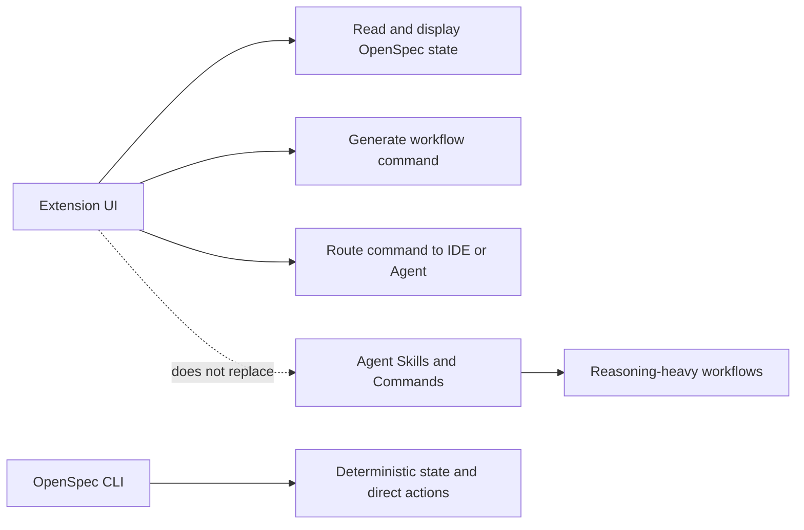
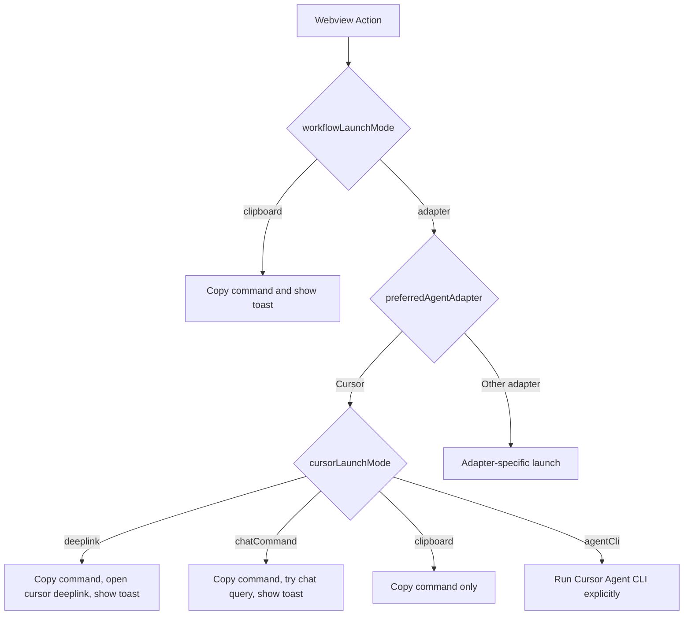
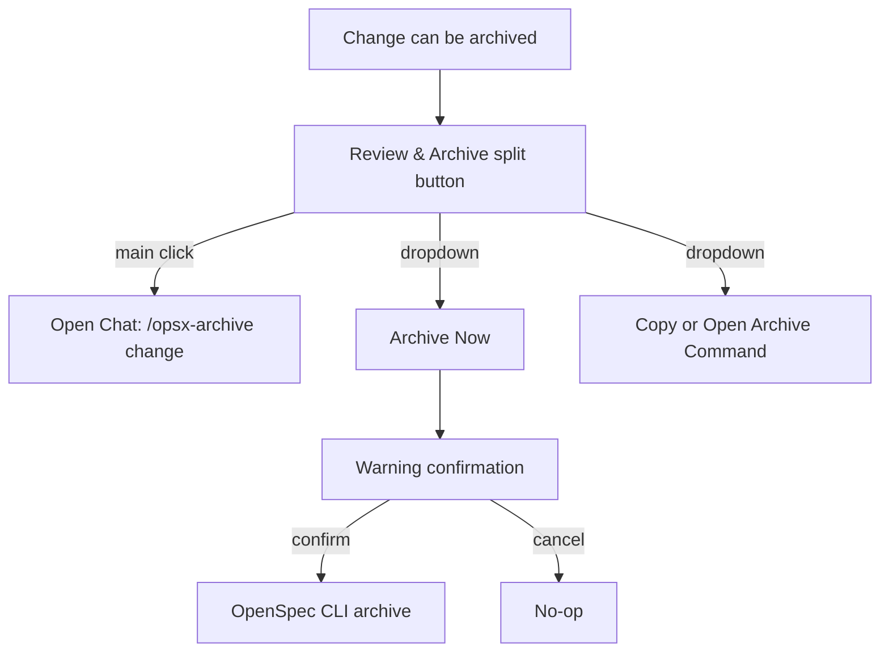
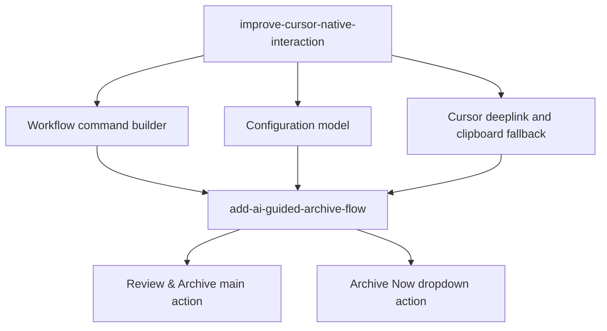

# Cursor 原生交互与 AI 归档流程设计

## 背景

OpenSpec 扩展的定位是 VS Code/Cursor 等 IDE 中的可视化工作流入口：扩展负责读取 OpenSpec 状态、展示 change 进度，并把用户操作转换为 Agent 可执行的稳定指令。当前 Dashboard 和 Change Detail 已提供 Continue、FF、Apply、Verify、Archive 等快捷操作，但 Cursor 中的实际体验仍有断点：

- Webview 多处硬编码 `/opsx:*` 命令，和 Cursor command 文件使用的 `/opsx-*` 形式不一致。
- 当前配置把安全默认、目标 adapter、Cursor 打开方式和自动执行混在一起，用户难以预期按钮行为。
- Cursor adapter 的 `fillChat` 主要是打开 Chat 并复制命令，不能稳定填入 Cursor Agent；官方 deeplink prompt 已验证可以打开并预填，但会显示用户确认框。
- 最近项目已加入 OpenSpec agent skills 和 workflows；Cursor plugin registration 可作为未来辅助 assets 注册能力，但不应作为 OpenSpec 生效前提。
- Archive 当前默认是 extension host 直接调用 CLI，缺少“先让 Agent 按 OpenSpec/Superpowers 流程审查再归档”的主路径。

本设计将能力拆成两个 change：先打通 Cursor 原生命令路由，再重塑 Verify/Archive 的 AI 引导交互。

## 总体原则

- 扩展不替代 Agent workflow。Apply、Verify、AI-guided Archive 等推理型流程由 Agent 通过 OpenSpec skills/commands 执行。
- Slash/Cursor command 是扩展和 Agent 之间的契约。扩展负责生成稳定命令，并按用户配置路由到 Clipboard、Cursor deeplink、Cursor Agent CLI、OpenCode、Copilot 等目标。
- OpenSpec CLI 用于确定性状态读取和用户明确选择的直接操作，例如 list/status/new/direct archive。
- MCP 不在当前范围内。当前工程已初始化 OpenSpec skills/commands，MCP 会重复暴露 OpenSpec 能力并增加运行时边界。

## Change 1: improve-cursor-native-interaction

### 目标

让扩展成为配置清晰、默认安全的 OpenSpec workflow launcher：默认复制命令，用户显式选择 adapter 后再按 Cursor deeplink、Chat command、Agent CLI 等方式启动目标工具，并统一 Cursor command 格式。

### 范围

- 将 workflow 启动配置拆成：`workflowLaunchMode`、`preferredAgentAdapter`、`cursorLaunchMode`、`taskExecutionMode`、`cursorAgentModel`。
- 将 `preferredAgentAdapter` 改成 enum 下拉并默认 `clipboard`，避免空值触发不透明的 adapter 优先级。
- 建立统一的 workflow command/payload builder，集中生成 `explore`、`continue`、`ff`、`apply`、`verify`、`archive`、`sync` 命令。
- Cursor/OpenCode 目标优先使用 hyphen command，例如 `/opsx-apply <change>`。
- 通用/Clipboard/兼容目标可继续使用 colon command，例如 `/opsx:apply <change>`，由 command builder 统一决定。
- Cursor adapter 的 `fillChat` 必须先复制命令并显示 toast，再按 `cursorLaunchMode` 尝试 deeplink、Chat query 或仅保留剪贴板。
- Cursor plugin registration 降级为未来增强，仅用于注册扩展自带辅助 assets，不作为本 change 的主路径。
- UI 文案改为真实动作，例如 `Open in Chat`、`Copy Command`、`Run Agent CLI`，避免用户误解为已经自动执行。

### 非目标

- 不实现 MCP。
- 不改变 OpenSpec skills/commands 的业务流程。
- 不让扩展直接实现 Apply/Verify 的 AI 逻辑。
- 不默认自动发送 Chat，预填后仍由用户确认发送。
- 不把 OpenSpec CLI 或项目初始化出的 `.cursor/commands`、`.cursor/skills` 打包成扩展生效前提。

### 架构

### 组件边界

- `workflowCommand`/`workflowLaunchPayload`：纯函数模块，输入 action、change name、目标 adapter、launch mode，输出命令文本或 CLI prompt。
- `configuration`：定义 workflow launch、adapter、Cursor launch、Cursor model 的配置边界和默认值。
- `cursorAdapter`：负责 Cursor 环境的可用性检测、deeplink/Chat query/clipboard/Agent CLI 行为；仅在用户显式选择自动执行路径时调用 Agent CLI。
- `webview`：传递 action intent 或消费 command builder 结果，不再散落硬编码 `/opsx:*` 字符串。
- `cursorPluginRegistration`：未来增强，可注册扩展自带辅助 plugin assets；不作为当前 OpenSpec workflow 生效路径。

### 成功标准

- 默认设置下点击 Continue、FF、Apply、Verify、Sync 等动作只复制命令并显示 toast，不自动打开外部 Agent。
- 用户选择 Cursor adapter 且 `cursorLaunchMode=deeplink` 时，扩展打开 Cursor deeplink 并预填正确命令，同时保留剪贴板 fallback。
- 非 Cursor 或 Cursor deeplink/Chat command 不可用时，扩展仍能复制命令，不影响 VS Code 用户。
- Cursor/OpenCode 不再错用 `/opsx:apply` 形式。
- 点击 Apply/Verify/Continue 等 Chat 路由动作不会直接修改 change 文件，只会打开预填命令或复制命令。

### 命令格式矩阵

| 目标 adapter | 命令格式 | 示例 |
| --- | --- | --- |
| Cursor Chat / Cursor Agent | hyphen | `/opsx-apply <change>` |
| OpenCode | hyphen | `/opsx-apply <change>` |
| VS Code Copilot / Generic Chat | colon | `/opsx:apply <change>` |
| Clipboard | colon | `/opsx:apply <change>` |
| Unknown adapter | colon | `/opsx:apply <change>` |

未知 adapter 默认使用 colon 格式，优先兼容现有 README、skills 文档和非 Cursor 环境。

### 配置矩阵

| 配置项 | 默认值 | 作用 |
| --- | --- | --- |
| `openspec.workflowLaunchMode` | `clipboard` | workflow 按钮默认复制，还是交给 adapter 路由 |
| `openspec.preferredAgentAdapter` | `clipboard` | adapter 模式下使用哪个目标工具 |
| `openspec.cursorLaunchMode` | `deeplink` | Cursor adapter 的 fillChat 打开方式 |
| `openspec.taskExecutionMode` | `fillChat` | 任务执行入口填充/复制还是自动执行 |
| `openspec.cursorAgentModel` | `auto` | Cursor Agent CLI 自动执行时使用的模型 |

### 测试策略

- 单元测试配置解析：默认 clipboard、adapter enum、Cursor launch mode、Cursor model 兼容读取。
- 单元测试 command/payload builder：不同 action、adapter target、launch mode 输出正确命令格式。
- 单元测试 Cursor deeplink builder 和 Cursor adapter fallback：deeplink 成功、deeplink 失败、chatCommand 成功/失败、clipboard-only。
- 手工验证 Cursor：默认点击 Apply 只复制并 toast；选择 Cursor deeplink 后点击 Apply 预填 `/opsx-apply <change>` 并保留剪贴板。
- 手工验证 VS Code：无 Cursor 能力时 fallback 到 clipboard，原有 dashboard 和 command palette 能力不回退。

## Change 2: add-ai-guided-archive-flow

### 目标

把 Archive 从单一 CLI 操作升级为“默认 AI 审查归档 + 可选直接归档”的组合按钮，符合 OpenSpec/Superpowers 的审查优先流程。

### 范围

- Archive 主按钮改为 `Review & Archive`。
- 主按钮触发 Agent command：`/opsx-archive <change>`。
- 主按钮旁增加下拉菜单，提供 `Archive Now`。
- `Archive Now` 调用现有 `dataManager.archiveChange(name)`，保留确定性 CLI 归档能力。
- 当 tasks 未完成或 artifacts 不完整时，默认仍推荐 AI 审查路径，用于让 Agent 给出修复、验证或归档建议；直接归档不作为推荐路径。
- Verify 完成后的推荐动作指向 `Review & Archive`，而不是直接 CLI archive。
- Dashboard change card 和 Change Detail action bar 的归档语义保持一致。

### 非目标

- 不修改 `/opsx-archive` skill 的具体流程。
- 不在扩展里重写 AI archive 的检查、review、sync 判断逻辑。
- 不移除现有 CLI archive command palette 能力。
- 不引入 MCP。

### 交互

### 状态规则

- `allTasksDone = true`：显示 `Review & Archive` 主按钮，`Archive Now` 下拉可用。
- `hasAnyTaskDone = true && !allTasksDone`：可显示 `Review & Archive` 入口，但语义是“让 Agent 审查并给出下一步建议”，不是承诺可以归档；`Archive Now` 默认禁用，除非后续明确设计强制逃生通道。
- artifacts 不完整：默认不鼓励直接归档；`Archive Now` 默认禁用，并提示先完成 artifacts 或使用 AI 审查路径。
- archived change：不显示归档动作，只读展示。

### 组件边界

- `SplitButton` 或 `ActionDropdown`：新增可复用 UI 组件，支持主动作和下拉动作。
- `ActionBar`/`ChangeCard`：根据 workflow state 渲染 `Review & Archive` split button。
- `webviewMessageHandler`：保留 `archiveChange` 作为 direct archive；复用 `fillChat` 发起 AI archive command。
- `workflowState`：区分 `archiveReviewAction` 和 `archiveNowAction`，不再用空 command 表示 Archive。

### 成功标准

- 用户点击主 `Review & Archive` 后进入 Agent 审查流程，而不是直接移动文件。
- 用户仍可从下拉选择 `Archive Now` 立即执行 CLI archive。
- 直接归档有明确确认和风险提示。
- Dashboard card 和 Change Detail 的归档行为一致。
- 点击主 `Review & Archive` 时，webview 只发送 Chat 路由消息，不发送 `archiveChange` 消息。
- 在 tasks 或 artifacts 未完成时，下拉中的 `Archive Now` 不可直接执行 CLI archive，并展示原因。

### 测试策略

- 单元测试 workflow state：完成、未完成、归档状态下 action 输出正确。
- 组件测试 split button：主按钮和下拉分别触发不同 callback。
- 手工验证：已完成 change 点击主按钮预填 `/opsx-archive <change>`；下拉 `Archive Now` 执行当前 CLI 归档。
- 回归验证：已有 `OpenSpec: Archive Change` command palette 行为不变。

## Change 依赖关系

`add-ai-guided-archive-flow` 依赖 `improve-cursor-native-interaction` 提供稳定命令生成、配置模型和 Cursor deeplink/clipboard fallback 路由。必须先完成该依赖，再接入第二个 change 的 AI 归档主路径。

## 待后续计划细化

- 为两个 change 分别创建 OpenSpec proposal、design、specs、tasks，并在工件中引用本设计文档。
- 第一阶段计划优先覆盖配置模型、command builder、Cursor deeplink、Cursor adapter fallback 和默认剪贴板体验。
- 第二阶段计划优先覆盖 split button、workflow state 归档动作建模、风险确认文案和 Dashboard/Detail 一致性。
- 后续实现时需要按 TDD 逐项补测试，并在 Cursor Extension Development Host 中做手工验证。
