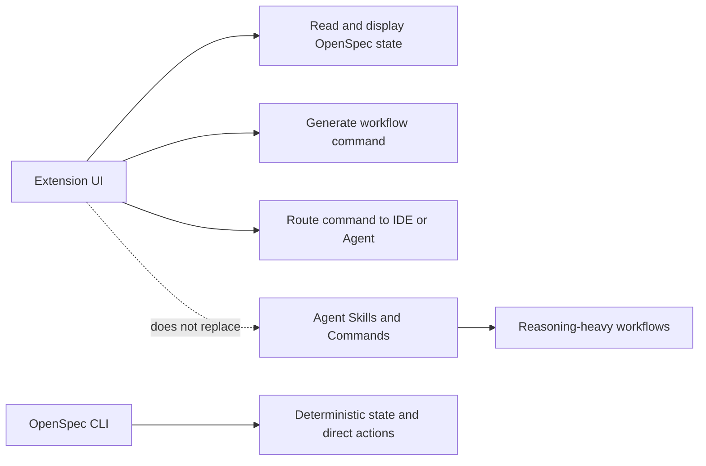
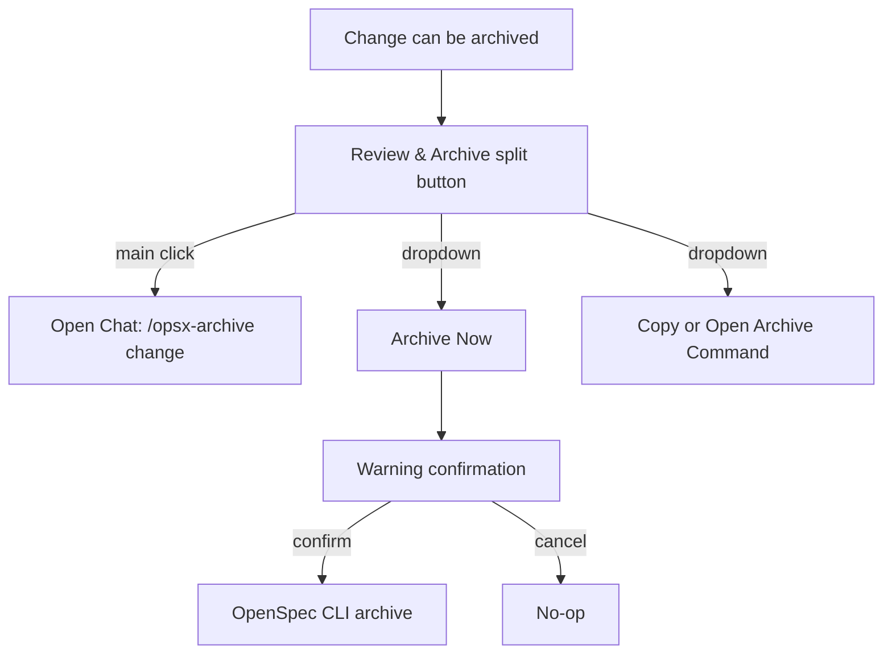
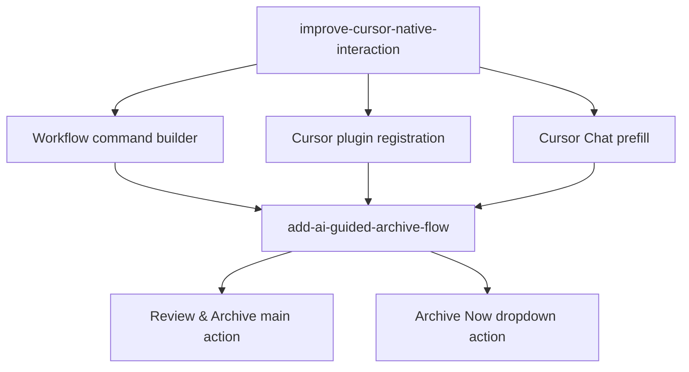

# Cursor 原生交互与 AI 归档流程设计

## 背景

OpenSpec 扩展的定位是 VS Code/Cursor 等 IDE 中的可视化工作流入口：扩展负责读取 OpenSpec 状态、展示 change 进度，并把用户操作转换为 Agent 可执行的稳定指令。当前 Dashboard 和 Change Detail 已提供 Continue、FF、Apply、Verify、Archive 等快捷操作，但 Cursor 中的实际体验仍有断点：

- Webview 多处硬编码 `/opsx:*` 命令，和 Cursor command 文件使用的 `/opsx-*` 形式不一致。
- Cursor adapter 的 `fillChat` 主要是打开 Chat 并复制命令，不能优先预填 Chat 输入。
- 最近项目已加入 OpenSpec agent skills 和 workflows，但扩展发布包还没有稳定地把 Cursor commands/skills 作为内置插件注册给 Cursor。
- Archive 当前默认是 extension host 直接调用 CLI，缺少“先让 Agent 按 OpenSpec/Superpowers 流程审查再归档”的主路径。

本设计将能力拆成两个 change：先打通 Cursor 原生命令路由，再重塑 Verify/Archive 的 AI 引导交互。

## 总体原则

- 扩展不替代 Agent workflow。Apply、Verify、AI-guided Archive 等推理型流程由 Agent 通过 OpenSpec skills/commands 执行。
- Slash/Cursor command 是扩展和 Agent 之间的契约。扩展负责生成稳定命令，并路由到 Cursor Chat、Agent CLI、OpenCode、Clipboard 等目标。
- OpenSpec CLI 用于确定性状态读取和用户明确选择的直接操作，例如 list/status/new/direct archive。
- MCP 不在当前范围内。当前工程已初始化 OpenSpec skills/commands，MCP 会重复暴露 OpenSpec 能力并增加运行时边界。



## Change 1: improve-cursor-native-interaction

### 目标

让扩展成为稳定的 OpenSpec workflow launcher，在 Cursor 中自动注册 OpenSpec commands/skills，并把 UI 操作转换成目标 Agent 能识别的固定命令。

### 范围

- 扩展启动时检测 `vscode.cursor?.plugins?.registerPath`，可用时注册扩展内置的 Cursor plugin 目录，并在 dispose 时 unregister。
- 将 OpenSpec Cursor commands/skills 作为扩展内置插件内容发布，避免用户手动复制 `.cursor/commands` 或 `.cursor/skills`。
- 建立统一的 workflow command builder，集中生成 `explore`、`continue`、`ff`、`apply`、`verify`、`archive`、`sync` 命令。
- Cursor/OpenCode 目标优先使用 hyphen command，例如 `/opsx-apply <change>`。
- 通用/Clipboard/兼容目标可继续使用 colon command，例如 `/opsx:apply <change>`，由 command builder 统一决定。
- Cursor adapter 的 `fillChat` 优先尝试 Chat query 预填；若目标 IDE 或版本不支持，则复制命令到剪贴板作为 fallback。Agent CLI 自动执行只在用户显式选择 `Run Agent CLI` 或配置 `openspec.taskExecutionMode=auto` 时发生，不作为默认 Chat 路径。
- UI 文案改为真实动作，例如 `Open in Chat`、`Copy Command`、`Run Agent CLI`，避免用户误解为已经自动执行。

### 非目标

- 不实现 MCP。
- 不改变 OpenSpec skills/commands 的业务流程。
- 不让扩展直接实现 Apply/Verify 的 AI 逻辑。
- 不默认自动发送 Chat，预填后仍由用户确认发送。

### 架构

```mermaid
flowchart TD
  A[Webview Action] --> B[Workflow Action Intent]
  B --> C[Workflow Command Builder]
  C --> D{Adapter Target}
  D -->|Cursor| E[/opsx-apply change]
  D -->|OpenCode| F[/opsx-apply change]
  D -->|Generic| G[/opsx:apply change]
  E --> H[Cursor Adapter]
  H --> I{Chat query supported?}
  I -->|yes| J[Open Chat with prefilled command]
  I -->|no| K[Copy command fallback]
```

### 组件边界

- `workflowCommand`：纯函数模块，输入 action、change name、目标 adapter，输出命令文本。
- `cursorPluginRegistration`：extension host 启动阶段注册内置 Cursor plugin path；无 Cursor API 时静默跳过。
- `cursorAdapter`：负责 Cursor 环境的可用性检测、Chat 预填和 fallback；仅在用户显式选择自动执行路径时调用 Agent CLI。
- `webview`：传递 action intent 或消费 command builder 结果，不再散落硬编码 `/opsx:*` 字符串。
- `.vscodeignore`/发布配置：确保内置 Cursor plugin 目录包含在 VSIX 中，同时不打包无关开发文件。

### 成功标准

- Cursor 中安装扩展后，无需手动复制 commands/skills，Agent 能识别 OpenSpec workflow commands。
- 点击 Continue、FF、Apply、Verify、Sync 等动作时，Cursor Chat 能预填正确命令。
- 非 Cursor 或 Cursor API 不可用时，扩展仍能复制命令，不影响 VS Code 用户。
- Cursor/OpenCode 不再错用 `/opsx:apply` 形式。
- Cursor plugin registration 在 Cursor 环境中对内置插件目录调用一次 `registerPath`，扩展释放时调用对应 `unregisterPath`。
- 点击 Apply/Verify/Continue 等 Chat 路由动作不会直接修改 change 文件，只会打开预填命令或复制命令。

### 命令格式矩阵

| 目标 adapter | 命令格式 | 示例 |
| --- | --- | --- |
| Cursor Chat / Cursor Agent | hyphen | `/opsx-apply <change>` |
| OpenCode | hyphen | `/opsx-apply <change>` |
| VS Code Copilot / Generic Chat | colon | `/opsx:apply <change>` |
| Clipboard | colon | `/opsx:apply <change>` |
| Unknown adapter | colon | `/opsx:apply <change>` |

未知 adapter 默认使用 colon 格式，优先兼容现有 README、skills 文档和非 Cursor 环境。

### 测试策略

- 单元测试 command builder：不同 action 和 adapter target 输出正确命令格式。
- 单元测试 Cursor plugin registration guard：无 `vscode.cursor` 时不抛错，有 API 时注册和注销目标路径。
- 手工验证 Cursor：安装扩展，打开 OpenSpec workspace，点击 Apply 后 Chat 预填 `/opsx-apply <change>`。
- 手工验证 VS Code：无 Cursor API 时 fallback 到 clipboard，原有 dashboard 和 command palette 能力不回退。

## Change 2: add-ai-guided-archive-flow

### 目标

把 Archive 从单一 CLI 操作升级为“默认 AI 审查归档 + 可选直接归档”的组合按钮，符合 OpenSpec/Superpowers 的审查优先流程。

### 范围

- Archive 主按钮改为 `Review & Archive`。
- 主按钮触发 Agent command：`/opsx-archive <change>`。
- 主按钮旁增加下拉菜单，提供 `Archive Now`。
- `Archive Now` 调用现有 `dataManager.archiveChange(name)`，保留确定性 CLI 归档能力。
- 当 tasks 未完成或 artifacts 不完整时，默认仍推荐 AI 审查路径，用于让 Agent 给出修复、验证或归档建议；直接归档不作为推荐路径。
- Verify 完成后的推荐动作指向 `Review & Archive`，而不是直接 CLI archive。
- Dashboard change card 和 Change Detail action bar 的归档语义保持一致。

### 非目标

- 不修改 `/opsx-archive` skill 的具体流程。
- 不在扩展里重写 AI archive 的检查、review、sync 判断逻辑。
- 不移除现有 CLI archive command palette 能力。
- 不引入 MCP。

### 交互



### 状态规则

- `allTasksDone = true`：显示 `Review & Archive` 主按钮，`Archive Now` 下拉可用。
- `hasAnyTaskDone = true && !allTasksDone`：可显示 `Review & Archive` 入口，但语义是“让 Agent 审查并给出下一步建议”，不是承诺可以归档；`Archive Now` 默认禁用，除非后续明确设计强制逃生通道。
- artifacts 不完整：默认不鼓励直接归档；`Archive Now` 默认禁用，并提示先完成 artifacts 或使用 AI 审查路径。
- archived change：不显示归档动作，只读展示。

### 组件边界

- `SplitButton` 或 `ActionDropdown`：新增可复用 UI 组件，支持主动作和下拉动作。
- `ActionBar`/`ChangeCard`：根据 workflow state 渲染 `Review & Archive` split button。
- `webviewMessageHandler`：保留 `archiveChange` 作为 direct archive；复用 `fillChat` 发起 AI archive command。
- `workflowState`：区分 `archiveReviewAction` 和 `archiveNowAction`，不再用空 command 表示 Archive。

### 成功标准

- 用户点击主 `Review & Archive` 后进入 Agent 审查流程，而不是直接移动文件。
- 用户仍可从下拉选择 `Archive Now` 立即执行 CLI archive。
- 直接归档有明确确认和风险提示。
- Dashboard card 和 Change Detail 的归档行为一致。
- 点击主 `Review & Archive` 时，webview 只发送 Chat 路由消息，不发送 `archiveChange` 消息。
- 在 tasks 或 artifacts 未完成时，下拉中的 `Archive Now` 不可直接执行 CLI archive，并展示原因。

### 测试策略

- 单元测试 workflow state：完成、未完成、归档状态下 action 输出正确。
- 组件测试 split button：主按钮和下拉分别触发不同 callback。
- 手工验证：已完成 change 点击主按钮预填 `/opsx-archive <change>`；下拉 `Archive Now` 执行当前 CLI 归档。
- 回归验证：已有 `OpenSpec: Archive Change` command palette 行为不变。

## Change 依赖关系



`add-ai-guided-archive-flow` 依赖 `improve-cursor-native-interaction` 提供稳定命令生成和 Chat 路由。若需要并行推进，第二个 change 的实现可以先以当前 `fillChat` 作为本地临时路由，但临时路由不得进入最终验收；最终 tasks 必须包含替换为 command builder 的收口任务。

## 待后续计划细化

- 为两个 change 分别创建 OpenSpec proposal、design、specs、tasks，并在工件中引用本设计文档。
- 第一阶段计划优先覆盖 command builder、Cursor plugin registration、Cursor adapter 预填和发布包包含规则。
- 第二阶段计划优先覆盖 split button、workflow state 归档动作建模、风险确认文案和 Dashboard/Detail 一致性。
- 后续实现时需要按 TDD 逐项补测试，并在 Cursor Extension Development Host 中做手工验证。
