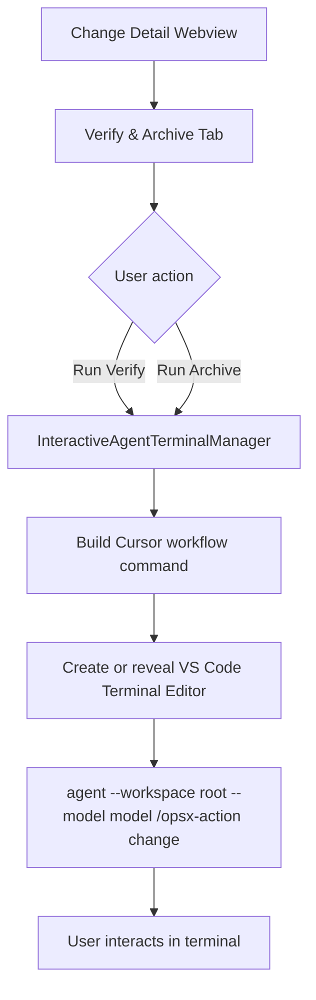

# Interactive Verify & Archive Terminal 设计

## 背景

`improve-cursor-native-interaction` 已经把 OpenSpec workflow action 统一成可路由命令，并支持 `clipboard`、`deeplink`、`chatCommand`、`agentCli` 等 Cursor launch mode。实际测试后发现，`agentCli` 当前使用 `agent -p ...` 的 headless 模式，适合一次性命令，但不适合 `/opsx-verify` 和 `/opsx-archive` 这类高影响 workflow。

Archive 的真实流程可能会询问用户是否先 sync delta specs，Verify 也可能要求用户确认或补充上下文。headless 输出只能进入 OutputChannel，用户无法继续输入，导致流程卡在“Agent 已经反问，但扩展没有交互入口”的状态。

同时，当前 Change Detail 页面在 tab 上方堆叠了 workflow stepper、Apply、Verify、Archive、Open in Editor、Refresh 等按钮，视觉层级混乱。新的设计需要同时解决交互式执行和详情页信息架构问题。

## 目标

- 将 Change Detail 重构为更接近 editor-native 工具页的信息架构。
- 将旧 `Verify` tab 升级为 `Verify & Archive` tab，作为高影响 workflow 的控制台。
- 使用 VS Code 官方 Integrated Terminal API 运行交互式 Cursor Agent CLI，不在 webview 内实现伪终端。
- Verify 和 Archive 通过真实终端交互执行，用户可以直接回答 Agent 的中途问题。
- 按 `change + action` 复用 terminal session，避免 Verify 和 Archive 互相污染。
- 保留现有 `cursorLaunchMode=agentCli` headless 路径，但明确它不是 Verify/Archive 的推荐交互入口。

## 非目标

- 不实现内嵌 xterm/node-pty 终端。
- 不实现 Cursor Agent CLI 的 `--resume` 或 `--continue` transcript UI。
- 不修改 `/opsx-verify` 或 `/opsx-archive` skill 的业务流程。
- 不移除 command palette 中的 direct archive 能力。
- 不改变 `clipboard`、`deeplink`、`chatCommand` 的既有路由语义。

## 推荐方案

采用“Change Detail 重设计 + 官方 Terminal Runner”。



该方案使用 VS Code 官方 `vscode.window.createTerminal` 和 `TerminalLocation.Editor`。它复用 IDE 的真实 shell、terminal settings、复制粘贴、滚动、快捷键、输入法和交互能力，避免在 webview 中重做终端。

## UI 信息架构

Change Detail 顶部改为克制的 editor-style header。

```text
Change Detail
  Header
    change name
    status summary: complete · 29/29 tasks · modified today
    global actions: Open File / Refresh / More

  Tabs
    Proposal
    Specs
    Design
    Tasks
    Verify & Archive

  Tab Content
    Artifact viewer / Task list / VerifyArchivePanel
```

调整点：

- 移除 tab 上方的大按钮堆叠。
- 顶部只保留全局低频动作，例如 `Open File`、`Refresh`、`More`。
- artifact 阅读和 workflow 执行分区：Proposal、Specs、Design、Tasks 用于阅读和编辑工件；`Verify & Archive` 用于高影响 workflow。
- `Verify & Archive` tab 展示两个 workflow 卡片：`Verify` 和 `Review & Archive`。
- tab 下方展示当前 terminal session 状态、最近命令，以及 `Reveal Terminal`、`Stop`、`Clear Session` 控制。

建议的 tab 内容：

```text
Verify & Archive
  Verify
    /opsx-verify <change>
    Run Verify

  Review & Archive
    /opsx-archive <change>
    Run Archive

  OpenSpec Agent Terminal
    Archive session running · started 12:03
    Last command: agent --workspace ... /opsx-archive ...
    Reveal Terminal | Stop | Clear Session
```

## Terminal Runner

新增 extension-host 服务：

```text
InteractiveAgentTerminalManager
  start(changeName, action)
  reveal(changeName, action)
  stop(changeName, action)
  clear(changeName, action)
  getSessionState(changeName)
```

`action` 只允许：

```text
verify | archive
```

session key：

```text
<workspaceRoot>::<changeName>::<action>
```

创建 terminal 时使用：

```text
name: OpenSpec: <change> / Verify
cwd: <workspaceRoot>
location: TerminalLocation.Editor
isTransient: true
```

发送命令时使用 Cursor target 的 hyphen command：

```bash
agent --workspace "<workspaceRoot>" --model <cursorAgentModel> /opsx-verify <change>
agent --workspace "<workspaceRoot>" --model <cursorAgentModel> /opsx-archive <change>
```

约束：

- 不使用 `-p` / `--print`，因为该模式是 headless/script 输出，不适合交互。
- 不使用 `--force`，因为 Verify/Archive 是高影响流程，应允许 Agent 正常询问。
- 默认读取 `openspec.cursorAgentModel`；空值或 `auto` 统一传 `auto`。
- `--workspace` 显式传入 workspace root，避免 Agent 推断错目录。
- terminal 的 `cwd` 也设为 workspace root，和 `--workspace` 保持一致。

## Session 复用规则

- Verify 和 Archive 按 `change + action` 分别复用 terminal。
- 如果同一个 `change + action` 的 terminal 仍存在：
  - `Reveal Terminal` 只调用 `terminal.show(false)`。
  - 再次点击 `Run` 不重复发送命令，避免在同一 session 中插入第二个 workflow。
  - UI 显示已有 session，并引导用户 Reveal、Stop 或 Clear。
- 如果 terminal 已关闭：
  - manager 清理 session 引用。
  - 下次点击重新创建 terminal 并发送命令。
- `Stop` 第一版直接 dispose terminal。
- `Clear Session` 第一版执行 `dispose + forget`，语义上代表结束并清空该 action 的 session。

## Webview 消息

新增 webview 到 extension host 的 intent message：

```text
runInteractiveWorkflow(changeName, action)
revealInteractiveWorkflow(changeName, action)
stopInteractiveWorkflow(changeName, action)
clearInteractiveWorkflow(changeName, action)
getInteractiveWorkflowState(changeName)
```

extension host 回传：

```text
interactiveWorkflowState {
  changeName,
  sessions: {
    verify?: {
      status,
      terminalName,
      lastCommand,
      startedAt,
      message
    },
    archive?: {
      status,
      terminalName,
      lastCommand,
      startedAt,
      message
    }
  }
}
```

状态枚举：

```text
idle | running | closed | error
```

Dashboard quick action 的建议行为：

- 点击 `Run Agent Verify` 或 `Run Agent Archive` 时打开 Change Detail。
- 自动切到 `Verify & Archive` tab。
- 第一版可以直接启动对应 terminal，并在 tab 内展示 session 状态。

## 错误处理

- `agent` 不存在：显示 `Cursor Agent CLI not found`，并提示用户运行 `agent login`、`agent status` 或检查 PATH。
- terminal 创建失败：toast 报错，并在 `Verify & Archive` tab 中显示 error 状态。
- 非 Cursor 环境：如果 `agent` CLI 可用，仍允许使用；否则显示不可用原因。
- archived change：禁用 `Run Archive`；`Run Verify` 可保留为只读验证入口或按实现风险禁用。第一版建议保留 Verify，禁用 Archive。
- 未完成 change：允许 `Run Verify` 和 `Run Archive`。Archive 此时进入 Agent review/advice，不承诺直接归档。
- 非法 action：extension host 拒绝，并返回 error 状态。

## 与现有配置和 change 的关系

`cursorLaunchMode=agentCli` 保留原语义，但文案应明确为 headless：

```text
Run Agent CLI (headless)
```

该路径继续用于显式配置下的一次性 workflow launch，不作为 Verify/Archive 的推荐交互入口。

现有 changes 的关系：

- `improve-cursor-native-interaction`：已完成，提供 command builder 和 launch config 基础，不再继续塞入新需求。
- `add-ai-guided-archive-flow`：需要调整 scope。Archive 的推荐入口从 split button 中心转为 `Verify & Archive` tab 的 `Run Archive`。`Archive Now` 可保留在 command palette 或 `More` menu 中作为 direct archive。
- 新 change `add-interactive-verify-archive-terminal`：负责 Change Detail redesign、Verify/Archive terminal runner、session 状态和 Dashboard quick action 对接。

## 测试策略

### Extension host

- `InteractiveAgentTerminalManager` 为 verify 创建 terminal，并发送：
  ```text
  agent --workspace <root> --model auto /opsx-verify <change>
  ```
- `InteractiveAgentTerminalManager` 为 archive 创建 terminal，并发送：
  ```text
  agent --workspace <root> --model auto /opsx-archive <change>
  ```
- 同一个 `change + action` 的 running session 复用 terminal，不重复发送命令。
- `reveal` 调用 `terminal.show(false)`。
- `stop` 和 `clear` dispose terminal 并更新 state。
- 读取 `openspec.cursorAgentModel`，空值和 `auto` 都传 `auto`。
- workspace path 和 change name 必须经过 shell quoting，避免空格或特殊字符破坏命令。

### Webview message handler

- `runInteractiveWorkflow` 调用 manager start 并回传 state。
- `revealInteractiveWorkflow` 调用 manager reveal。
- `stopInteractiveWorkflow` 和 `clearInteractiveWorkflow` 更新 state。
- archived change 上 archive 被拒绝。
- 非法 action 被拒绝。

### Webview components

- Change Detail tabs 显示 `Verify & Archive`，不再显示旧 `Verify`。
- tab 上方不再堆叠 Verify/Archive workflow 按钮。
- 点击 `Run Verify` 发送 `runInteractiveWorkflow('verify')`。
- 点击 `Run Archive` 发送 `runInteractiveWorkflow('archive')`。
- running 状态下显示 `Reveal Terminal`、`Stop`、`Clear Session`。
- Dashboard quick action 打开详情页并切到 `Verify & Archive`，必要时直接启动对应 workflow。

### 手工验证

- `pnpm test`
- `pnpm run build`
- Cursor Extension Development Host 中验证：
  - Change Detail 页面层级变清晰。
  - 点击 `Run Verify` 立即打开 Terminal Editor。
  - 点击 `Run Archive` 立即打开 Terminal Editor。
  - Agent 反问时用户可以在 terminal 中输入回复。
  - 同一个 change/action 再次点击会复用 terminal。
  - `Reveal`、`Stop`、`Clear Session` 行为符合预期。

## 成功标准

- Verify/Archive 不再依赖 OutputChannel 作为主要交互界面。
- Archive 流程中 Agent 反问时，用户可以继续输入并完成流程。
- Change Detail 顶部不再出现混乱的大按钮堆叠。
- `Verify & Archive` 成为高影响 workflow 的明确入口。
- 现有 clipboard/deeplink/chatCommand/headless agentCli 路由不被破坏。
- Direct archive 仍作为明确的直接操作存在，但不再是 Change Detail 的主推荐路径。
