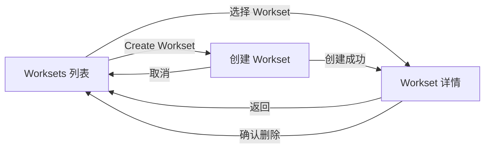

# Worksets 列表、详情与创建体验设计

## 决策摘要

Worksets 采用一条连续的侧边栏流程，而不是把列表和详情做成两个竞争方案：



- 列表负责发现和进入 Workset。
- 详情负责理解成员拓扑、打开整个 Workset、切换当前项目和切换 Planning root。
- 创建是从列表进入的第三种状态，不是独立的信息架构。
- 页面继续使用现有 VS Code 主题变量、紧凑密度、轻量分隔线和 Codicon 风格图标。

本设计以 2026-09-01 已确认的高保真合并稿为视觉基准。实现时应匹配现有 OpenSpec Sidebar，而不是引入新的全屏工作台或新的视觉系统。

## 背景与现状

当前代码已经具备以下基础：

- `WorksetsPage` 可以展示机器级 Workset 列表，并发送打开、删除消息。
- `WorksetProjectPicker` 能读取当前项目关联的 Workset，区分 `project` 与 `store` 成员，并切换可选项目。
- `ProjectDataGateway` 会重新读取官方 Workset 和 Store 清单、规范化绝对路径，并在 Store 清单不可用时 fail closed，避免把 Store 错当成可写项目。
- `DataManager.openWorkset()` 使用普通命令执行器调用 `openspec workset open <name>`。
- `DataManager.removeWorkset()` 通过官方 CLI 删除保存记录，删除前已有模态确认；成员目录不会被删除。
- `selectScope` 已能切换 Planning root，`selectWorksetProject` 已能切换当前项目上下文。

当前缺口是：

- Project-first Sidebar 中的 Workset 直接展开全部成员，缺少清晰的列表与详情层级。
- 没有 Create Workset UI。
- 没有一次性 `--tool` 覆盖入口。
- 当前 Workset 详情无法把“当前项目”和“Planning root”作为两个独立上下文明确表达。

OpenSpec 官方语义保持不变：Workset 是机器本地的多目录视图；Store 是 OpenSpec 的 Planning root。Workset 不负责复制上下文、任务分发、权限授予或 Git 同步。官方说明见 [Stores beta user guide](https://github.com/Fission-AI/OpenSpec/blob/main/docs/stores-beta/user-guide.md)。

## 目标

- 在窄侧边栏中提供可扫描的 Workset 列表。
- 进入详情后明确显示成员角色，以及当前项目和 Planning root。
- 支持通过 UI 创建 Workset，并明确第一个成员是 Primary。
- 支持按保存工具打开，也支持一次性工具覆盖。
- 复用现有 CLI、路径规范化、Store 分类和项目切换能力。
- 保持 Workset 与 Store selector、Git 管理和 OpenSpec root 解析相互独立。

## 非目标

- 不实现 Git clone、pull、push 或仓库同步。
- 不解析或修改 OpenSpec 私有的全局 Workset 文件。
- 不实现成员编辑；CLI 没有正式 update 命令前，不通过“删除再创建”伪装成编辑。
- 不新增 `Reference` Workset 成员角色；当前模型只支持 `project | store`。
- 不让打开 Workset 自动改变 Planning root。
- 不新增路由库、状态管理库或完整组件系统。
- 不因为 Workset 存在而增加自动激活；继续使用当前显式 View 入口。

## 信息架构

### 1. Worksets 列表

入口为 Project-first Sidebar 的 `Worksets` tab。

顶部继续复用现有 Header 所表达的两个上下文：

- `Project`：当前浏览和执行项目级操作的目录。
- `Planning root`：当前 OpenSpec 命令解析到的 Local root 或 Store。

如果 Header 已经展示这两个上下文，列表内容区不再重复绘制一张上下文卡片。

列表行包含：

- Workset 名称。
- 成员数量。
- 保存的工具；未设置时显示 `Default tool`。
- `Open` 快捷操作。
- 进入详情的整行点击区域和 chevron。

行为：

- 点击行主体进入详情，不立即打开外部工具。
- 点击 `Open` 直接使用保存工具打开；事件必须阻止行点击冒泡。
- 顶部 `Create Workset` 进入创建状态。
- 列表只显示包含当前项目的 Workset，沿用 `ProjectDataGateway.loadWorksetNavigation()` 的现有过滤语义。
- 空状态说明当前项目尚未加入 Workset，并保留 `Create Workset` 主操作。

### 2. Workset 详情

详情顶部包含：

- 返回列表。
- Workset 名称。
- 保存工具的只读显示；它不是编辑已保存 Workset 的入口。
- `Open all` 主操作。
- `Open with another tool` 次操作；展开后输入一次性 tool id。

成员区只使用一个分组 surface，以行分隔，不为每个成员创建独立卡片。

成员行为按角色决定：

| 成员状态 | 展示 | 可用操作 |
|---|---|---|
| 当前 Project | `Project · Current` | 无操作，不重复切换 |
| 其他可选 Project | `Project` | `Switch project` |
| 不可选 Project | `Project · Unavailable` | 只读显示路径或原因 |
| 当前 Planning Store | `Store · Current root` | 无操作 |
| 其他 Store | `Store` | `Use as planning root` |

约束：

- `Switch project` 继续发送现有 `selectWorksetProject(worksetName, memberPath)`；Extension Host 必须重新读取官方 Workset 清单后再接受路径。
- `Use as planning root` 只能对已由官方 Store inventory 匹配出的成员开放。Webview 只提交 Workset 名称和成员路径，Host 重新读取官方 Workset/Store inventory 后，再映射并选择对应 Store scope。
- Store inventory 获取失败时不猜测角色、不显示可执行的项目或 Store 切换动作。
- 打开 Workset 不触发 `selectScope`。
- `Remove Workset` 保持危险操作样式，并继续使用现有模态确认。

### 3. Create Workset

创建采用单屏表单，不做多步骤向导。

字段：

1. `Name`
   - trim 后必须非空。
   - 重名和 CLI 命名规则由官方 CLI 最终校验。
2. `Primary project`
   - 默认当前项目。
   - 可从已选成员中指定其他 Primary，但当前项目仍必须保留在 Members 中。
   - Primary 必须同时出现在 Members 中。
   - 发送 CLI 参数时永远排在第一个 `--member`。
3. `Members`
   - 当前项目默认加入，并且在 Project-first 创建流程中不可移除，确保新 Workset 创建后仍能在当前列表中找到。
   - 通过 VS Code 原生文件夹选择器追加一个或多个目录。
   - 相同规范化路径只保留一次。
   - 至少一个成员。
4. `Preferred tool`
   - 可选。
   - 使用可编辑 combobox：快捷项提供 `code`、`cursor`，同时允许输入用户在 OpenSpec `openers` 配置中的自定义 id。
   - Extension 不读取或写入 OpenSpec 私有全局配置。

提交摘要明确显示：

- 将打开多少个目录。
- Primary 是哪个目录。
- 创建 Workset 不改变当前 Planning root。

创建成功后刷新 Project Sidebar 数据，并直接进入新 Workset 详情。创建失败时保留表单内容并展示错误，不做乐观成功状态。

## 状态模型

组件只需要三个本地视图状态：

```ts
type WorksetsViewState =
  | { kind: 'list' }
  | { kind: 'detail'; name: string }
  | { kind: 'create' };
```

不引入路由。离开 `Worksets` tab 后允许状态重置为列表；当前版本不需要跨会话持久化所选 Workset。

刷新规则：

- 详情中的 Workset 刷新后仍存在：保持详情。
- Workset 被外部删除或重命名：回到列表并显示一次轻量提示。
- 创建中发生普通数据刷新：保留用户草稿。
- 切换当前项目：重新加载该项目关联的 Workset，并回到列表。

## 数据与消息流

### 现有消息继续复用

| 消息 | 用途 |
|---|---|
| `openWorkset(name)` | 使用保存工具打开整个 Workset |
| `removeWorkset(name)` | 确认后删除本地保存记录 |
| `selectWorksetProject(worksetName, memberPath)` | 切换到另一个 Project 成员 |
| `selectScope(scopeId)` | 保留给现有 Root selector 使用 |

### 最小新增消息

| 消息 | 方向 | 用途 |
|---|---|---|
| `pickWorksetMembers` | Webview → Host | 打开 VS Code 文件夹多选器 |
| `worksetMembersPicked` | Host → Webview | 返回用户选择的绝对目录 |
| `createWorkset(name, members, tool?)` | Webview → Host | 创建 Workset；`members[0]` 为 Primary |
| `worksetCreateResult` | Host → Webview | 明确返回成功或失败，成功时包含名称 |
| `selectWorksetStore(worksetName, memberPath)` | Webview → Host | 重新验证成员后切换对应 Store scope |

扩展现有 `openWorkset` 为：

```ts
openWorkset(name: string, tool?: string)
```

- 没有 `tool`：执行 `openspec workset open <name>`。
- 有 `tool`：执行 `openspec workset open <name> --tool <id>`。
- 一次性覆盖不修改保存的 `WorksetView.tool`。

创建命令保持 selector-free：

```text
openspec workset create <name> \
  --member <primary-path> \
  --member <other-path>... \
  [--tool <id>] \
  --json
```

`workset list/create/open/remove` 都不能附加当前 Store selector。Workset 是机器级状态，不属于某个 Planning root。

## 组件映射

首期优先修改现有路径，不建立新的通用框架：

- `Dashboard.tsx`
  - 保留现有 `Worksets` tab 和数据加载。
  - 连接创建、打开覆盖、Store 选择消息。
- `WorksetProjectPicker.tsx`
  - 继续作为 Project-first Worksets 工作区的协调组件。
  - 在内部管理 `list/detail/create` 状态。
  - 复用现有成员角色、当前项目判断和切换逻辑。
- `WorksetsPage.tsx`
  - 保持机器级 Workset 管理页可用。
  - 复用相同的列表行视觉规则；不强行加入缺少 Project 上下文的切换动作。
- `messages.ts`
  - 扩展 `openWorkset` 可选 tool。
  - 增加创建、文件夹选择和 Workset Store 选择消息。
- `DataManager`
  - 增加 `createWorkset()`。
  - 扩展 `openWorkset()` 的一次性 tool 参数。
- `dashboardViewProvider` / `webviewMessageHandler`
  - 调用 VS Code 文件夹选择器。
  - 成功创建后刷新正确的 Project Sidebar 数据，而不仅是旧 Dashboard 数据。

如果 `WorksetProjectPicker.tsx` 因三种状态明显失去可读性，再拆出 `WorksetListView`、`WorksetDetailView`、`WorksetCreateForm`；首个实现不提前建立组件目录或抽象层。

## 错误处理与安全边界

- Workset capability 明确为 `false`：隐藏创建、打开、删除入口，沿用升级提示。
- `workset list --json` 失败：不把失败伪装成空列表；Project navigation 保持 fail closed。
- 文件夹选择取消：保留创建表单，不显示错误。
- 成员目录不存在或无法规范化：不加入表单，提示用户重新选择。
- CLI 创建失败：不刷新为成功状态，不清空草稿。
- 打开工具失败：通过现有 `error` 消息反馈，详情保持不变。
- Store inventory 不可靠：隐藏 `Switch project` / `Use as planning root` 等需要角色信任的动作。
- `selectWorksetStore` 必须像现有 Project 切换一样重新读取官方成员关系，不能直接信任 Webview 提交的 Store id 或路径。
- 删除仅删除 Workset 记录；确认文案明确“不删除成员目录、仓库或 Store”。
- 所有来自 Webview 的名称、tool id 和路径都视为不可信输入；Host 侧必须校验类型，并由 CLI 或重新读取的官方清单完成最终授权。

## 可访问性与视觉约束

- 行主体和行内 `Open` 是两个独立可聚焦控件。
- 所有 icon-only button 必须有 `aria-label` 和 tooltip。
- 当前项目使用文字 `Current`，不能只靠绿色。
- Store 与 Project 除颜色外还要有文字标签和不同图标。
- focus 使用 `--vscode-focusBorder`，不能只设计 hover。
- 窄宽度下操作换行或降级为行尾菜单，不截断 Workset 名称和关键角色。
- 尊重 `prefers-reduced-motion`；状态切换只需 120–160ms 的轻量颜色/透明度变化。
- 继续使用 VS Code theme tokens，不写死深色背景或前景色。

## TDD 与验收标准

实现按以下顺序先写失败测试，再补最小代码：

### 组件测试

- 列表默认不展开成员，点击行进入对应详情。
- `Open` 不触发详情导航，只发送一次打开消息。
- 返回详情前一层后恢复列表。
- Current Project、可选 Project、Store 分别显示正确动作。
- Store inventory 不可用时不显示角色切换动作。
- Create 表单拒绝空名称、空成员和重复成员。
- Primary 始终排在提交 members 的第一位。
- 一次性工具覆盖只影响本次 open 消息。
- 键盘可完成列表进入、返回、打开和创建流程。

### Extension Host 测试

- `createWorkset()` 生成准确的 selector-free CLI 参数，并使用 JSON runner。
- `openWorkset(name)` 继续使用普通 runner，不请求 JSON。
- `openWorkset(name, tool)` 只追加 `--tool <id>`。
- `selectWorksetStore` 只接受重新读取后仍属于该 Workset 的 Store 成员。
- 文件夹选择取消不发送成功结果。
- 创建成功刷新 Project Sidebar 数据；失败发送错误且不伪造刷新。
- 删除仍保留现有确认与“只删记录”语义。

### 回归门槛

- `pnpm test`
- `pnpm run build`
- `npx eslint src/`；只报告与本次改动相关的新问题，现有环境 globals 问题单独标注。
- 在 VS Code Extension Development Host 中人工验证：列表 → 详情 → 创建 → 打开 → 一次性 tool override → 删除取消/确认。

## 分阶段交付

### 阶段 1：列表与详情

- 只重排现有数据和动作。
- 不新增 CLI mutation。
- 验证 Project 与 Planning root 不互相污染。

### 阶段 2：创建与一次性工具覆盖

- 新增文件夹选择、create 命令和 tool override。
- 创建成功进入详情。
- 保持所有 Workset 命令 selector-free。

### 阶段 3：视觉与文档收口

- 按高保真稿校正间距、边框、focus 和窄宽度。
- 更新中英文文案、README/截图和命令边界说明。

成员编辑、Git 管理和自动激活不进入这三个阶段；只有 OpenSpec 发布正式 Workset update 能力或实际用户证据证明需要时，再单独设计。
