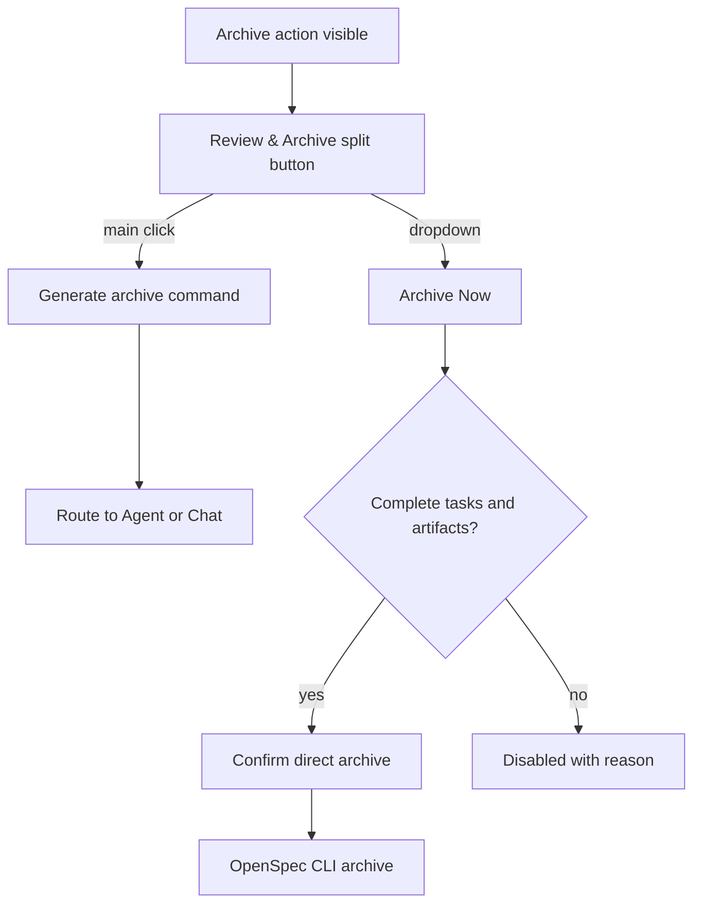

## Context

参考 Superpowers 设计文档：[Cursor 原生交互与 AI 归档流程设计](../../../docs/superpowers/specs/2026-05-23-cursor-native-interaction-and-ai-archive-design.md)。

当前扩展将 Archive 作为直接 CLI 操作暴露在 Dashboard 和 Change Detail 中。这适合用户明确要执行确定性归档的场景，但不适合作为默认入口：归档前通常需要检查任务是否完成、实现是否与 artifacts 一致、delta specs 是否需要 sync、是否已经完成必要 review。OpenSpec/Superpowers 的这些判断更适合交给 Agent 执行 `/opsx-archive <change>`。

本 change 依赖 `improve-cursor-native-interaction` 提供稳定的 workflow command builder 和 Chat 路由。当前设计假设主按钮只发起 Agent command，不直接移动文件。

## Goals / Non-Goals

**Goals:**

- 将归档主动作改为 `Review & Archive`，默认进入 `/opsx-archive <change>` Agent 流程。
- 使用主按钮 + 下拉菜单组合，保留 `Archive Now` 直接 CLI 归档入口。
- 在 tasks 或 artifacts 未完成时禁用直接归档，并解释原因。
- 保持 Dashboard card 和 Change Detail action bar 的归档语义一致。
- 保留现有 command palette 的直接 archive 能力。

**Non-Goals:**

- 不修改 `/opsx-archive` skill 的具体步骤。
- 不在扩展里重写 Agent archive 审查逻辑。
- 不引入 MCP。
- 不移除 direct archive 能力。
- 不实现 `improve-cursor-native-interaction` 的 command builder；本 change 只消费该能力。

## Decisions

### Decision: Archive 主按钮默认走 AI-guided review

主按钮命名为 `Review & Archive`，点击后生成 archive workflow command 并通过 selected adapter 打开 Chat 或 fallback。它不发送 `archiveChange` message，也不调用 `dataManager.archiveChange`。这样默认路径符合“归档前先 review/verify/sync 判断”的流程。

备选方案是保留 Archive 主按钮直接归档，并新增 AI review 次要按钮。该方案延续当前高风险默认路径，不符合用户确认的方向，因此不采用。

### Decision: 直接归档作为下拉动作

`Archive Now` 放在 split button 下拉菜单中，表达这是用户显式选择的快捷路径。选择后继续复用现有 extension host direct archive 流程和确认弹窗。这样保留确定性 CLI 能力，同时把默认推荐路径交给 Agent。

### Decision: 未完成状态禁用 Archive Now

当 tasks 未完成或 required artifacts 不完整时，`Review & Archive` 可以作为 Agent review/advice 入口出现，但 `Archive Now` 默认禁用并展示原因。这样避免 UI 暗示不完整 change 可以直接归档，也符合归档前必须有完成证据的流程底线。

### Decision: 新增可复用 split button/dropdown 组件

归档交互需要主动作和次要动作并存，新增 `SplitButton` 或 `ActionDropdown` 组件比在 ActionBar/ChangeCard 中手写特殊分支更清晰。组件应支持 disabled reason、主动作、菜单动作和键盘可访问性。

### Decision: workflow state 明确建模归档动作

当前 workflow state 中 Archive secondary action 使用空 command 表示特殊行为。该设计容易让 UI 和 handler 分叉。应改为显式建模 `archiveReviewAction` 与 `archiveNowAction`，或在 action 类型中带 `kind` 字段，避免通过空字符串推断行为。

## Risks / Trade-offs

- [Risk] split button 增加 UI 复杂度，窄 sidebar 中可能占用空间。→ Mitigation: 在窄视图中可降级为单个 `Review & Archive` 按钮加更多菜单。
- [Risk] `Review & Archive` 在未完成 change 上出现可能被误解为可归档。→ Mitigation: 文案和 tooltip 明确其语义为 review/advice，`Archive Now` 禁用。
- [Risk] 第二个 change 依赖第一个 change 的 command builder。→ Mitigation: tasks 中包含最终收口任务，临时 fillChat 路由不得作为最终验收。
- [Risk] 保留 command palette direct archive 与 UI 默认 AI archive 可能造成路径差异。→ Mitigation: 文档和文案明确 command palette 是直接 CLI 操作，UI 主路径是 AI-guided。

## Migration Plan

1. 新增 split button/dropdown 组件和测试。
2. 更新 workflow state，显式区分 `Review & Archive` 和 `Archive Now`。
3. 迁移 Change Detail action bar 的 Archive 行为。
4. 迁移 Dashboard change card 的 Archive 行为。
5. 保留 `archiveChange` message 和 command palette direct archive 行为。
6. 基于 `improve-cursor-native-interaction` 的 command builder 接入 archive workflow command。

Rollback 策略：如果 split button 或 AI 路由出现问题，可保留 `Archive Now` direct archive 路径，并临时隐藏 `Review & Archive` 主按钮；不影响现有 CLI archive command palette。

## Open Questions

- 无阻塞性 open question。最终实现需要在 `improve-cursor-native-interaction` 完成后接入 command builder；若并行实现，只允许使用当前 fillChat 作为临时路由，不能作为最终验收结果。
