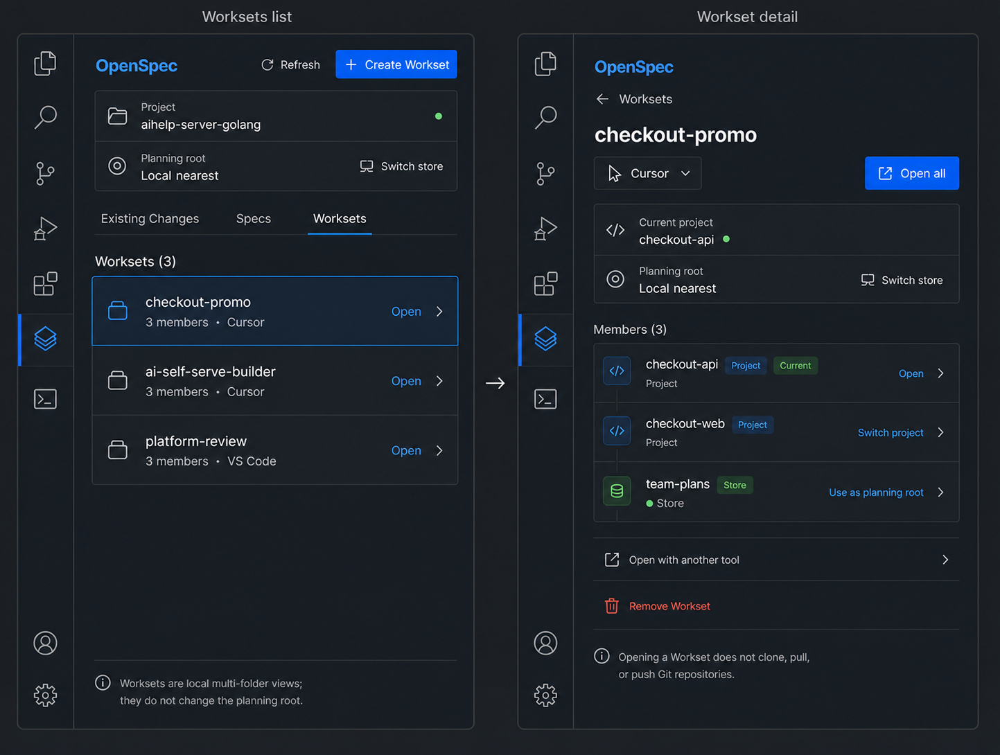
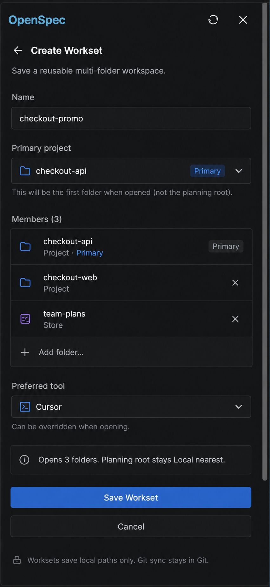

## Context

The selected product direction and rejected alternatives are recorded in [explore.md](explore.md). The proposal defines the MVP and the four capability deltas under [specs/](specs/).

The change crosses Webview state, Webview/Host messages, native VS Code folder selection, OpenSpec CLI execution, Project binding, and Store-member validation. It therefore needs one explicit flow across the existing modules rather than an isolated component-only change.

Current reusable structure:

- `Dashboard.tsx` selects the Project-first `changes | specs | worksets` view and receives binding-scoped snapshots.
- `WorksetProjectPicker.tsx` already renders trusted Project/Store member roles and sends Project-switch/open actions.
- `ProjectDataGateway` already obtains selector-free Workset/Store inventories, canonicalizes paths, fail-closes when Store identity is unavailable, and resolves bindings with an optional explicit Store id.
- `dashboardViewProvider` owns current Project identity, accepted Project binding, refresh generations, and binding-safe snapshot publication.
- `DataManager` and `OpenSpecCliService` already distinguish ordinary CLI output from JSON output.

### Approved visual targets

The following images are implementation inputs, not inspirational moodboards. List and detail are two states of the same narrow Sidebar flow.





The VS Code Activity Bar and outer window chrome in the images belong to the host. The extension implements only its existing Webview area. Existing Header content may replace a duplicated Project/Planning-root card, but the same hierarchy and semantic separation must remain visible.

## Goals / Non-Goals

**Goals:**

- Implement list, detail, and create as focused Project-first Sidebar states.
- Use official CLI commands for every Workset read/write/open operation.
- Keep Current Project identity and Planning root independently visible and safely switchable.
- Revalidate Project and Store members before accepting Webview navigation hints.
- Preserve ordinary Workset-open output and support one-time opener override.
- Match the approved images at the current narrow Sidebar width using VS Code theme tokens, existing typography, and accessible controls.

**Non-Goals:**

- Editing an existing Workset's members or saved tool.
- Reading or mutating private OpenSpec Workset registry files.
- Git clone, pull, push, or sync.
- A full editor-area Worksets workspace.
- A new router, state library, design system, or runtime dependency.
- Automatic activation when no existing OpenSpec View activation condition is met.

## Decisions

### 1. Keep Worksets navigation as local component state

`WorksetProjectPicker` will coordinate three local states:

```text
WorksetsViewState
  +-- list
  +-- detail(name)
  +-- create(draft)
```

No route or persisted selection is added. Switching away from the Worksets tab or changing Project identity resets to `list`. A normal snapshot refresh preserves `detail(name)` only when the named Workset still exists and preserves `create(draft)` while the current Project identity is unchanged.

Alternative considered: storing the state in global `AppContext`. Rejected because no other surface consumes the navigation state and persistence would create stale-name/draft recovery work without user value.

### 2. Reuse trusted navigation data for list and detail

The list and detail both render from `ProjectSidebarData.worksetNavigation`, not the broader legacy `DashboardData.worksets` inventory. This retains the existing guarantee that every displayed Workset contains the current canonical Project and every member role comes from fresh Workset plus Store inventories.

```text
OpenSpec CLI
  workset list --json   store list --json
          \                 /
           \               /
            ProjectDataGateway
             - realpath members
             - classify project/store
             - filter by current Project
                     |
                     v
       ProjectWorksetNavigationData
                     |
              list / detail UI
```

The legacy `WorksetsPage` remains a machine-level management surface. It may reuse row styling, but it does not gain Project or Planning-root actions without a Project-bound navigation payload.

Alternative considered: classify members again inside React from `storeRootPaths`. Rejected because role classification is a trust boundary already implemented in the Host.

### 3. Preserve the high-fidelity hierarchy without duplicating the Header

Visual implementation rules:

- The list row is one grouped surface with lightweight separators, not one card per row.
- Row body enters detail; the inline `Open` control is independently focusable and stops event propagation.
- Detail uses one grouped member surface. Project and Store identity use both label and icon; color alone is insufficient.
- `Current` and `Current root` are states, not disabled buttons.
- Create is one scrollable form; it is not a wizard or modal.
- Primary and destructive actions use existing VS Code button/error tokens.
- Focus uses `--vscode-focusBorder`; all icon-only controls have tooltip and `aria-label`.
- At approximately 430 px Sidebar width, names truncate before action labels overlap. No horizontal scrolling is introduced.
- Motion is limited to 120–160 ms color/opacity transitions and honors `prefers-reduced-motion`.

The implementation does not copy hard-coded colors, gradients, typography, or outer chrome from the PNGs. It maps their hierarchy to existing VS Code variables so light, dark, and high-contrast themes remain usable.

### 4. Add the minimum Webview/Host messages

```text
Webview -> Host
  pickWorksetMembers
  createWorkset { name, members, tool? }
  openWorkset { name, tool? }              (extends existing)
  selectWorksetStore { worksetName, memberPath }
  selectProjectDefaultRoot

Host -> Webview
  worksetMembersPicked { paths }
  worksetCreateResult { success, name, message? }
  setContext { view: sidebar, data }        (existing snapshot path)
  error { message }                        (existing failure path)
```

Folder-picker responses need no new request registry because only one Create form can exist. The Webview ignores `worksetMembersPicked` unless the current state is `create`; leaving the form makes a late response harmless.

Message payloads are untrusted. The Host checks primitive types, trims names/tool ids, canonicalizes paths, and delegates official Workset validation to the CLI or fresh inventory reads.

Alternative considered: running the complete creation interaction through VS Code QuickPick/InputBox. Rejected because it would not match the approved single-screen form or keep validation feedback adjacent to the fields.

### 5. Create through the official selector-free JSON command

The create sequence is:

```text
Create form
   |
   | pickWorksetMembers
   v
vscode.window.showOpenDialog(canSelectFolders, canSelectMany)
   |
   | worksetMembersPicked
   v
Draft: name + ordered unique canonical members + optional tool
   |
   | createWorkset
   v
DataManager.createWorkset
   |
   | runJson([
   |   'workset', 'create', name,
   |   '--member', primary,
   |   '--member', other,
   |   '--tool', tool?, '--json'
   | ])
   v
reload Project Sidebar snapshot -> worksetCreateResult -> detail(new name)
```

`DataManager.createWorkset()` builds the repeated arguments directly and never calls a shell. Primary is represented only by array order; no parallel Primary field is persisted. The current Project is required in the Project-first form but may appear after another selected Primary in the submitted list.

No `--store` flag is appended. Workset creation is machine-global even when the current Project binding resolves to a Store.

On success, `dashboardViewProvider` reloads the Project Sidebar through official data sources. The Webview enters detail only after the refreshed navigation contains the created name. On failure, the draft remains and the result carries a recoverable message.

### 6. Extend open with a one-time tool only

`openWorkset(name, tool?)` remains an ordinary command path:

```text
tool absent  -> runCommand(['workset', 'open', name])
tool present -> runCommand(['workset', 'open', name, '--tool', tool])
```

It never requests JSON and never modifies the saved `WorksetView.tool`. The detail shows the saved tool as information. `Open with another tool` reveals an editable combobox with `code` and `cursor` shortcuts and allows a configured custom opener id because OpenSpec does not expose an opener-enumeration command.

Alternative considered: parsing the global OpenSpec `openers` configuration. Rejected because it would duplicate private configuration semantics and create an unsupported write/read dependency.

### 7. Treat Workset Store selection as a Project-binding operation

The Workset detail action does not call the legacy `DataManager.selectScope()` path. It is a distinct Project-first operation:

```text
Use as planning root(worksetName, memberPath)
   |
   v
ProjectDataGateway.resolveWorksetStore(...)
   - re-read workset list
   - re-read store list
   - canonicalize memberPath
   - require named Workset + Store role
   - return validated storeId
   |
   v
ProjectDataGateway.resolveBinding(currentProject, storeId)
   - CLI context --store <storeId>
   - verify projectId / commandCwd / root / storeId
   |
   v
dashboardViewProvider accepts new binding
   - explicitProjectStoreId = storeId
   - current Project unchanged
   - reload Project Sidebar for that binding
```

`ProjectDataGateway.loadProjectSidebarData(project, explicitStoreId?)` and its binding-scoped readers are extended to accept the validated selector. `dashboardViewProvider` owns an ephemeral `explicitProjectStoreId`; it passes that value when refreshing or switching among members of the same trusted Workset. The selector never leaks into Workset list/create/open/remove commands.

`selectProjectDefaultRoot` clears the ephemeral selector only after a fresh selector-free binding for the same Project resolves and validates successfully. This provides an explicit escape from a selected Store.

If membership or binding validation fails, the previous Project, binding, watcher, explicit selector, and visible snapshot remain untouched.

Alternative considered: converting the Store id to `store:<id>` in the Webview and sending the existing `selectScope` message. Rejected because it trusts Webview topology, updates the legacy scope rather than the Project-first binding, and cannot guarantee that Project-bound data follows the displayed Planning root.

### 8. Preserve refresh and race safety

Existing `projectRequestGeneration` remains the authority for rejecting stale snapshot loads. Store selection, Project selection, and create-success refresh all increment that generation through the existing reload path.

- A detail name missing from the accepted snapshot resets the local view to list.
- A Project identity change resets list/detail/create state.
- A binding-only change keeps the selected Workset detail when it still exists.
- A failed mutation or binding resolution does not publish optimistic data.

### 9. Keep component extraction demand-driven

The first implementation changes `WorksetProjectPicker.tsx` in place and reuses small pure helpers for selected Workset lookup, member deduplication, Primary ordering, and view-state reconciliation. `WorksetListView`, `WorksetDetailView`, or `WorksetCreateForm` are extracted only if the resulting file becomes difficult to test or review.

No dependency or generic Workset framework is added.

## Risks / Trade-offs

- **[CLI beta shape changes]** → Keep capability gating, exact argv tests, defensive JSON parsing, and no private-file fallback.
- **[Configured opener ids cannot be enumerated]** → Use an editable combobox and let the official CLI return the actionable validation error.
- **[High-fidelity images show one dark theme and outer VS Code chrome]** → Treat hierarchy and spacing as the contract; use theme tokens and verify dark, light, and high-contrast states in the real Extension Host.
- **[Explicit Store selection could diverge from current Project data]** → Re-resolve one binding for the same Project with the validated Store id and publish only a binding-matching snapshot.
- **[Late folder-picker or refresh response could overwrite another state]** → Gate picker responses on Create state and retain generation-based snapshot rejection.
- **[Workset removal/edit outside the extension invalidates detail]** → Reconcile detail name against every accepted snapshot and return to list when absent.
- **[Single component may grow]** → Extract state views only when tests demonstrate that in-file boundaries are no longer clear.

## Migration Plan

No stored-data migration is required. Existing Workset files remain owned by OpenSpec.

1. Add failing tests for CLI argv, Host validation, message contracts, and view transitions.
2. Implement list/detail using existing navigation data without changing mutation commands.
3. Add creation and folder-picker messages, then one-time open override.
4. Add validated Store-binding selection and `Use project default` recovery.
5. Add i18n/accessibility states and visually compare real Sidebar captures with both approved images.
6. Run focused tests, full tests, build, lint scope, and Extension Development Host acceptance.

Rollback removes the new messages and local states while leaving existing saved Worksets untouched. The old fully expanded Project picker remains recoverable from version control; no registry conversion is needed.

## Open Questions

None. The optional custom opener id intentionally remains free-form because the CLI has no official opener inventory endpoint.

## Spec Amendments

- [x] `openspec-scope-management`: clarified that a Workset Planning Store re-resolves and replaces the binding for the same Project instead of mutating the legacy selected scope.
- [x] `workset-project-navigation`: added an explicit `Use project default` recovery path when a Workset Store is the current Planning root.
- [x] `workset-cli-open`: retained the management-page open and action-label scenarios because a MODIFIED requirement replaces the complete existing block.
