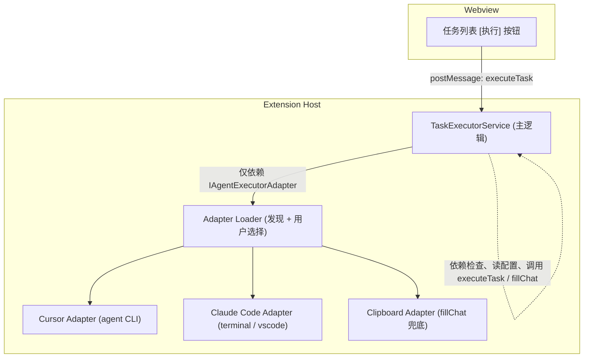

# Design: 插件与多 IDE/AI 交互（Adapter 架构）

## 设计目标

- 主代码与具体 IDE/Agent 实现**隔离**，通过 Adapter 接口与加载机制扩展。
- **用户可选**执行者：激活时识别可用 Adapter，由用户选择使用哪个。
- 支持**自动执行**与**填入 Chat**两种模式；无法预填时使用**复制到剪贴板**兜底。
- 第一期实现少量 Adapter，**接口与扩展点**为后续更多 Adapter 预留空间。

---

## 1. Adapter 接口与契约

所有「命令执行者」统一通过以下抽象与主逻辑交互。

### 1.1 请求与结果类型

```ts
// 执行请求（主逻辑 → Adapter）
interface TaskExecuteRequest {
  changeName: string;
  taskIndex: number;
  taskText: string;
  contextFiles: string[];   // 相对路径，如 ['openspec/changes/foo/design.md', 'tasks.md']
  workspaceRoot: string;
}

// 执行结果（Adapter → 主逻辑）
interface TaskExecuteResult {
  success: boolean;
  message?: string;
  adapterId: string;
}
```

### 1.2 Adapter 接口

```ts
interface IAgentExecutorAdapter {
  readonly id: string;           // 唯一标识，如 'cursor' | 'claude-code' | 'clipboard'
  readonly displayName: string;  // 用于设置/选择 UI 展示

  /** 当前环境是否可用（如 CLI 存在、API 可用） */
  isAvailable(): Promise<boolean>;

  /** 自动执行：直接执行任务，不打开 Chat */
  executeTask(request: TaskExecuteRequest): Promise<TaskExecuteResult>;

  /** 填入 Chat：打开 Chat 并预填，或复制到剪贴板兜底 */
  fillChat(request: TaskExecuteRequest): Promise<TaskExecuteResult>;
}
```

- 主逻辑**仅依赖**上述接口与类型，不引用具体 Adapter 实现文件。
- Adapter 实现放在独立模块（如 `adapters/`），由加载器在激活时发现并实例化。

---

## 2. Adapter 发现与用户选择

- **发现**：在 Extension 激活（或打开 OpenSpec 视图）时，对已注册的 Adapter 列表逐个调用 `isAvailable()`，得到「当前可用」的 Adapter 列表。
- **用户选择**：通过配置项（如 `openspec.preferredAgentAdapter`）保存用户选择的 Adapter id；若未设置或所选 Adapter 不可用，则使用列表中的第一个可用 Adapter，或在设置/UI 中让用户重新选择。
- **展示**：在设置页或「执行任务」前的入口，展示可用 Adapter 列表及当前选中项，允许用户切换。

不采用「写死优先级」的自动选择，始终以用户选择为准；仅当所选不可用时才回退到默认（如第一个可用或 clipboard）。

---

## 3. 执行模式与 fillChat 兜底

- **执行模式**（已有结论）：配置项 `openspec.taskExecutionMode`：`auto` | `fillChat`，默认 `fillChat`。
- **auto**：调用当前所选 Adapter 的 `executeTask(request)`。
- **fillChat**：调用当前所选 Adapter 的 `fillChat(request)`。
- **fillChat 兜底**：若某 Adapter 无法真正「预填 Chat」（例如无相应 API），则在该 Adapter 的 `fillChat` 中改为将生成的 prompt/命令复制到剪贴板，并提示用户「已复制到剪贴板，可粘贴到 Chat」。主逻辑不区分「预填」与「复制」，均视为 fillChat 成功。

---

## 4. Claude Code 的定位与实现方式

- **定位**：从插件视角，Claude Code 只是**众多执行者之一**，不是独立产品形态；插件只负责「在用户选择该 Adapter 时，用统一方式触发执行」。
- **触发方式**（Adapter 实现时二选一或都支持）：
  - **方式 A**：通过 VSCode 中已安装的 Claude Code 相关扩展/命令触发（若存在对应 API）。
  - **方式 B**：新建 Terminal，在 workspace 根目录执行 `claude` CLI 及对应 OpenSpec 命令（与文档一致，例如 `/opsx:apply <change> --task="..."` 或等价的 `claude` 参数）。
- 具体以哪种方式触发、参数格式，由 Claude Code Adapter 实现内部决定；接口仍为 `executeTask` / `fillChat`。

---

## 5. 依赖检查（与 task-management 一致）

- 依赖定义：同一 change 的 `tasks.md` 中，按**文档顺序**的前序任务均为当前任务的依赖。
- 点击「执行」时：先解析 `tasks.md`，得到任务列表与完成状态；若存在未完成的前序任务，则**默认阻止执行**并列出未完成任务；可选配置「依赖未完成时仅警告仍执行」。
- 依赖检查逻辑属于主逻辑（或 task-management 能力），不放在 Adapter 内。

---

## 6. 目录与扩展约定

- **接口与类型**：放在主代码区域（如 `services/agentExecutor.types.ts` 或等价位置），供主逻辑与所有 Adapter 引用。
- **Adapter 实现**：置于独立目录，例如 `src/extension/adapters/`：
  - `index.ts`：注册所有 Adapter 构造函数/工厂，并实现「发现可用 Adapter」的加载器。
  - `cursor-adapter.ts`、`claude-code-adapter.ts`、`clipboard-adapter.ts` 等，各实现 `IAgentExecutorAdapter`。
- **扩展新 Adapter**：新增文件实现接口，并在 `adapters/index.ts` 中注册即可；主逻辑与配置/UI 无需改行为，仅需在「可选 Adapter 列表」中展示新 id/displayName。

---

## 7. 第一期范围与后续扩展

- **第一期**：
  - 完成 Adapter 接口、加载与用户选择机制。
  - 实现 1～2 个 Adapter（建议：Cursor（`agent` CLI）+ 通用「剪贴板」Adapter 作为 fillChat 兜底或独立选项）。
  - 任务列表上的「执行」入口、依赖检查、与执行模式（auto / fillChat）的串联。
- **后续可扩展**：
  - Claude Code Adapter（Terminal 或 VSCode 集成）。
  - VSCode Copilot Chat Participant（@openspec）+ 同一 fillChat 的剪贴板兜底。
  - 其他 AI 工具（如 Windsurf、Trae）按同接口增加 Adapter。

---

## 8. 配置项汇总

| 配置键 | 类型 | 说明 |
|--------|------|------|
| `openspec.taskExecutionMode` | `'auto' \| 'fillChat'` | 点击任务后的行为：直接执行 vs 填入 Chat（或剪贴板） |
| `openspec.preferredAgentAdapter` | `string` | 用户选择的 Adapter id；空或不可用时回退到默认 |
| `openspec.taskDependencyPolicy` | `'block' \| 'warn'` | 依赖未完成时：阻止执行 vs 仅警告仍执行（可选，默认 block） |

---

## 9. 架构示意



- **TaskExecutorService**：依赖检查；读取 `taskExecutionMode`、`preferredAgentAdapter`；调用当前 Adapter 的 `executeTask(request)` 或 `fillChat(request)`。
- **Adapter Loader**：注册 Cursor / Claude Code / Clipboard 等 Adapter；通过 `isAvailable()` 得到可用列表；按配置或用户选择解析出当前 Adapter。

以上设计满足：主代码与具体执行者隔离、用户可选 Adapter、Claude Code 作为可选执行者、fillChat 剪贴板兜底，以及便于后续增加新 Adapter。
