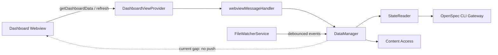
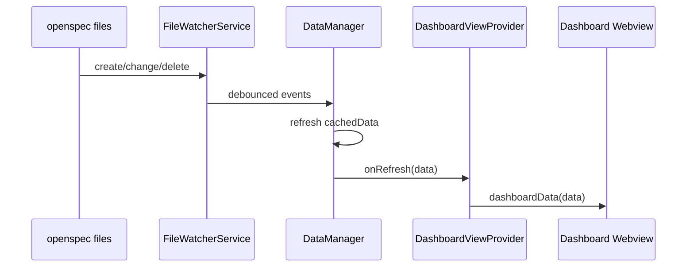

## Context

本设计承接 proposal 中的 Dashboard 响应性、自动同步、任务确认和搜索摘要改进；参考 Superpowers 设计文档：[Dashboard 响应性与搜索体验改进设计](../../../docs/superpowers/specs/2026-04-30-improve-dashboard-responsiveness-and-search-design.md)。

当前扩展遵循 CLI Gateway → State Reader → Content Access → DataManager 的四层隔离。Dashboard sidebar 通过 `DashboardViewProvider` 创建 webview，webview 初次加载后发送 `getDashboardData`，Extension Host 通过 `DataManager.getDashboardData()` 返回缓存或刷新结果。`FileWatcherService` 已监听 `openspec/**/*.md` 和 `openspec/**/*.yaml`，并在变化后调用 `DataManager.refresh()`；问题是刷新结果只更新 `cachedData`，没有主动推送给已打开的 sidebar。任务勾选确认目前在 Extension Host 中用 VS Code modal 完成，导致确认反馈依赖 VS Code 原生弹窗生命周期。

## Goals / Non-Goals

**Goals:**

- 让 sidebar 使用已有 Dashboard 缓存即时展示，避免点击 OpenSpec 或 change 卡片时触发额外全量扫描。
- 让文件监听、任务状态变化、手动 refresh、new/archive 等路径共享同一个刷新结果，并主动推送给已打开的 sidebar。
- 在 Dashboard change 卡片展示 Proposal `## Why` 摘要和完整悬浮提示。
- 在 sidebar 内提供本地搜索，覆盖 change name、status、artifact id、Proposal Why 文本等已加载数据。
- 将任务勾选确认从 VS Code modal 移到 webview 内，点击后立即显示确认 UI，确认后才写入 `tasks.md`。
- 保留手动 Refresh 按钮作为强制重新读取 OpenSpec 状态的兜底入口。

**Non-Goals:**

- 不新增外部依赖或独立搜索索引服务。
- 不实现跨所有 artifact 的后台全文索引；本阶段搜索只覆盖 Dashboard 已加载的 active change 元数据和 Proposal Why 文本。
- 不改变 OpenSpec CLI 的输出格式，也不依赖 CLI 内部实现。
- 不改变归档 change 的只读限制和现有 adapter/fillChat 工作流。

## Decisions

### 1. 刷新事件携带数据，并由 DashboardViewProvider 主动推送

`DataManager.refresh()` 继续是唯一刷新入口，但 `notifyRefresh` 应携带本次生成的 `DashboardData`。`DashboardViewProvider` 在构造或注册阶段订阅 `dataManager.onRefresh`，如果 sidebar webview 已存在，就发送 `{ type: 'dashboardData', data, debug }`。这样文件监听、任务 toggle、new/archive、命令 refresh 都能复用同一条通道。

选择该方案而不是让 webview 定时轮询，是因为扩展已经有文件 watcher 和缓存，主动推送能减少空转 CLI 调用，也更符合 VS Code webview 的消息模型。

### 2. Proposal Why 摘要在 Extension Host 生成

`ChangeInfo` 增加可选字段：

- `proposalWhySummary?: string`
- `proposalWhyFullText?: string`
- `searchText?: string`

刷新时在 `DataManager` 或专门的小工具函数中读取每个 change 的 `proposal.md`，提取 `## Why` 到下一个二级标题之间的文本，去掉 Markdown 标记与多余空白，生成 150 字摘要。读取失败、proposal 缺失或 Why 为空时返回空字段，不阻塞 Dashboard。

选择在 Extension Host 生成摘要，而不是 webview 逐个请求 artifact，是因为 Dashboard 列表一次性需要摘要和搜索文本；由 host 在 refresh 阶段批量准备可以保持 UI 简单，并让搜索不产生额外消息往返。

### 3. 搜索在 webview 本地完成

`ChangesSection` 增加受控搜索输入，对 `changes` 做 memoized filter。匹配字段包括 `change.name`、`change.status`、artifact id/status、`proposalWhySummary`、`proposalWhyFullText`、`searchText`。过滤后再按 status 分组；标题显示过滤后的数量，空结果显示“没有匹配的 change”。

选择本地过滤而不是 host RPC，是因为本阶段搜索数据都已经随 `dashboardData` 到达，避免每次输入都跨 webview 边界或触发 CLI。

### 4. 任务确认前移到 webview

`TaskList` 点击 checkbox 后不直接发送 `toggleTask`，而是把待确认任务交给 `ChangeDetail` 状态；`ChangeDetail` 渲染 `ConfirmDialog`。用户确认后再发送 `toggleTask`，取消则只关闭 dialog，不修改本地任务状态和 `tasks.md`。Extension Host 的 `toggleTask` case 移除 VS Code modal，只执行写入、refresh、返回新的 `dashboardData` 和 `tasks` artifact 内容。

选择 webview 内确认，是因为它能在点击后立即显示反馈，视觉和交互完全由 React 控制，也避免 VS Code modal 自带关闭按钮与自定义 Cancel 文案造成重复取消入口。

### 5. 保持消息协议小步扩展

现有 `dashboardData` 和 `toggleTask` 消息可以继续使用；只需要扩展 `ChangeInfo` 数据结构。任务确认不需要新增 host 消息，因为确认发生在 webview 内，确认后仍发送原 `toggleTask`。如果后续需要 host 强校验，可在 `toggleTask` 写入前保留 archive/read-only 检查。

| 方向 | 消息 | 触发时机 | 结果 |
|------|------|----------|------|
| Webview → Host | `getDashboardData` | sidebar 初次加载 | Host 返回缓存或刷新后的 `dashboardData` |
| Webview → Host | `refresh` | 用户点击手动 Refresh | Host 强制 `DataManager.refresh()` 并返回 `dashboardData` |
| Host → Webview | `dashboardData` | 初次加载、手动刷新、文件监听刷新、任务写入后 | sidebar 更新 change/spec 列表和搜索数据 |
| Webview → Host | `toggleTask` | 用户在 webview 确认框点击确认后 | Host 写入 `tasks.md`，刷新数据并返回最新任务内容 |

## Risks / Trade-offs

- Proposal Why 提取对 Markdown 格式有假设 → 提取器应容忍缺失标题、中文标题外的普通文本和空内容，失败时返回空摘要。
- Refresh 时读取 proposal 可能增加文件 IO → 只读取 active changes 的 proposal，和 CLI list/status 并行或串行控制；后续可按 lastModified 做 memo cache。
- 自动推送可能与手动 refresh 同时发生 → `DataManager.refresh()` 作为唯一入口，必要时增加 in-flight refresh 合并，避免并发覆盖。
- Webview 本地搜索不能搜索未加载 artifact 全文 → 明确作为本阶段边界；后续可扩展 host-side index。
- 移除 host modal 后，其他入口若直接发送 `toggleTask` 会绕过确认 → webview 是当前任务勾选入口；host 保留 archive/read-only 与输入有效性检查，测试覆盖 UI 入口。

## Migration Plan

1. 扩展 `ChangeInfo` 类型并补充 Proposal Why 提取工具。
2. 调整 `DataManager.refresh()` 和 refresh callback，使刷新结果可主动推送。
3. 让 `DashboardViewProvider` 订阅刷新事件，并在 sidebar 存在时发送最新 `dashboardData`。
4. 在 `ChangesSection`/`ChangeCard` 增加搜索输入和 Why 摘要展示。
5. 在 `ChangeDetail`/`TaskList` 接入 `ConfirmDialog`，并移除 host 中任务 toggle 的 VS Code modal。
6. 增加单元测试后，通过 VS Code Extension Development Host 手工验证 sidebar 自动刷新、搜索过滤、摘要展示和任务确认。

回滚策略：如果自动推送或 webview 确认出现问题，可以保留手动 refresh 和原 `toggleTask` 写入路径；撤回 UI 确认接入后，host 仍能执行任务状态写入。

## Open Questions

无。当前选择已足以进入 specs 和 tasks 阶段；更完整的跨 artifact 全文索引留作后续独立能力。
