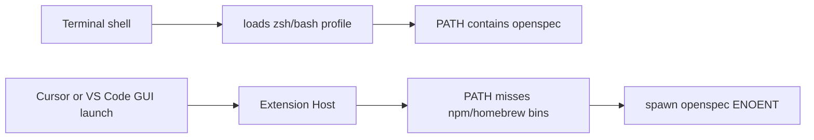
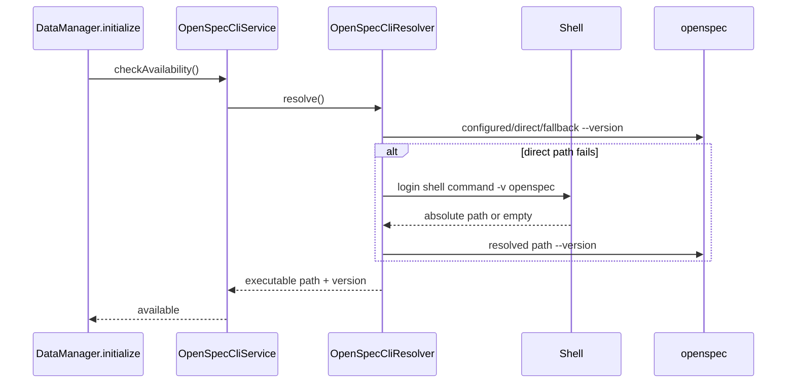

## Context

本设计承接 proposal 中的 CLI 路径解析 BUG；参考 Superpowers 设计文档：[OpenSpec CLI 路径解析设计](../../../docs/superpowers/specs/2026-04-30-resolve-cli-path-from-shell-design.md)。

当前 `OpenSpecCliService` 在激活时直接执行 `spawn('openspec', args, { env: process.env })`。当 Cursor/VS Code 由 macOS GUI 启动时，Extension Host 的 `PATH` 可能没有加载用户 shell 配置，因此终端可执行 `openspec`，插件却报 `spawn openspec ENOENT`。这个问题发生在 CLI Gateway 层，修复应保持 CLI 作为唯一状态来源，不引入文件扫描 fallback。

## Goals / Non-Goals

**Goals:**

- 支持用户通过 `openspec.cliPath` 显式配置 OpenSpec CLI 绝对路径。
- 当直接 `spawn('openspec')` 失败时，通过用户 shell 的 login 环境解析 `openspec` 绝对路径。
- 解析成功后缓存 CLI 绝对路径，后续所有 OpenSpec CLI 命令复用该路径。
- 解析失败时提供诊断信息，包括 extension host PATH、shell、已尝试的解析方式和配置建议。
- 保持现有 CLI Gateway、State Reader、Content Access 分层边界。

**Non-Goals:**

- 不在 CLI 不可用时改用纯文件扫描状态源。
- 不修改 OpenSpec CLI 安装方式或打包 CLI。
- 不要求用户必须从终端启动 Cursor/VS Code。
- 不为 agent adapter CLI 一并重构 PATH 解析；可后续复用同一工具独立处理。

## Decisions

### 1. CLI 路径解析优先级采用 A+B（配置 + 自动解析）组合

OpenSpec CLI 解析按以下顺序进行：

1. `openspec.cliPath` 配置项：如果用户配置了非空路径，优先使用该路径执行 `--version` 验证。
2. 当前 Extension Host `PATH`：尝试直接查找并执行 `openspec`，保持 Linux、Windows、终端启动等现有成功路径。
3. 用户 shell login 环境：在 macOS/Linux 上执行 `${SHELL:-/bin/zsh} -l -c 'command -v openspec'` 获取绝对路径。
4. 常见安装路径 fallback：检查 `/opt/homebrew/bin/openspec`、`/usr/local/bin/openspec`、`/usr/bin/openspec` 等。
5. 全部失败后显示 CLI not found 诊断。

选择该顺序，是为了让显式用户配置可覆盖所有自动推断，同时让多数 Homebrew/npm 全局安装用户不需要手动配置。

### 2. 将解析能力封装为 OpenSpec CLI resolver

在 Extension Host 内新增一个小型 resolver，职责是“找到可执行的 openspec 路径并解释失败原因”。`OpenSpecCliService` 不再硬编码 `spawn('openspec')`，而是先调用 resolver 获取命令路径，再用该路径执行所有 CLI 命令。

该 resolver 应缓存成功解析结果，避免每次 CLI 调用都启动 shell。缓存只在扩展进程生命周期内有效；如果用户修改配置，需要在下一次解析或配置变更时清空。

### 3. shell 解析必须受控且只用于定位

shell fallback 只执行固定命令 `command -v openspec`，不拼接用户输入。执行时设置较短 timeout（例如 5 秒）并捕获 stdout/stderr。解析出的路径必须再通过 `--version` 验证，不能仅凭字符串存在就信任。

选择 `command -v` 而不是 `which`，是因为它是 POSIX shell 内建，能反映 login shell PATH，并避免依赖外部 `which` 命令。

### 4. 错误提示升级为可诊断信息

当所有解析路径失败时，通知应继续给出安装说明，同时在 OpenSpec output log 中记录：

- `process.env.PATH`
- `process.env.SHELL`
- `openspec.cliPath` 是否设置
- 每个解析策略的结果或错误
- 推荐配置示例：`openspec.cliPath = /opt/homebrew/bin/openspec`

用户可见错误保持简洁，但提供“安装说明”和“打开设置”两个动作。这样既不向普通用户暴露过多技术细节，也能帮助排查环境问题。

### 5. 配置项设计

新增配置：

- `openspec.cliPath`
  - 类型：`string`
  - 默认值：`""`
  - 说明：OpenSpec CLI executable path. Leave empty to auto-detect from PATH and login shell.

该配置属于 CLI Integration capability，不改变其他 adapter 配置。

## Risks / Trade-offs

- shell 启动慢或用户 shell 配置有副作用 → 只在直接解析失败时执行 shell fallback，并缓存成功结果；设置短 timeout。
- `SHELL` 指向不可用 shell → fallback 到 `/bin/zsh`、`/bin/bash` 或跳过 shell 解析，并记录诊断。
- 用户配置了错误的 `openspec.cliPath` → 明确优先使用配置并验证失败，错误提示应指出配置路径不可执行或版本命令失败。
- Windows shell 行为不同 → Windows 主要依赖配置项和当前 PATH；shell fallback 仅在可安全识别为 `cmd.exe`、PowerShell 或 Git Bash 等已知 shell 时启用，否则跳过并记录诊断。
- 绝对路径缓存可能在 CLI 被移动后失效 → 命令执行 ENOENT 时清空缓存并重新解析一次。

## Migration Plan

1. 增加 `openspec.cliPath` 配置项和本地化文案。
2. 新增 OpenSpec CLI resolver 单元，覆盖配置路径、当前 PATH、login shell、常见路径和失败诊断。
3. 修改 `OpenSpecCliService` 使用 resolver 返回的命令路径执行 CLI。
4. 更新 CLI not found 错误提示与 output log 诊断。
5. 增加单元测试模拟 `spawn ENOENT`、shell fallback 成功、配置路径优先和全部失败。
6. 手工验证：从 GUI 启动 Cursor/VS Code，确认终端可用但 Extension Host PATH 缺失时仍能激活。

回滚策略：保留直接 `openspec` 执行路径；如果 resolver 出现问题，可以临时配置 `openspec.cliPath` 指向绝对路径。

## Open Questions

无。A+B 组合方案已经覆盖用户明确要求：显式配置优先，同时自动从 shell login 环境解析。
