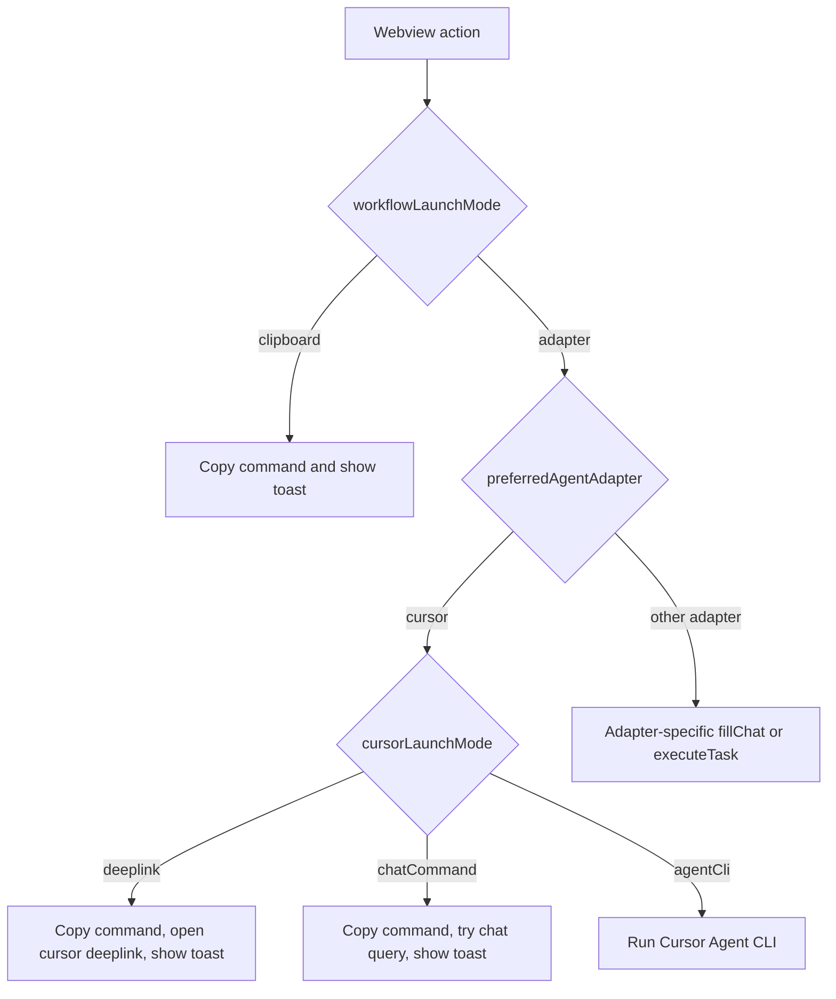

## Context

参考 Superpowers 设计文档：[Cursor 原生交互与 AI 归档流程设计](../../../docs/superpowers/specs/2026-05-23-cursor-native-interaction-and-ai-archive-design.md)。

当前扩展已经具备 Dashboard、Change Detail、Task execution entry、Agent adapter 等基础能力，但配置体验和 Cursor 启动方式混在一起：`preferredAgentAdapter` 为空时会按内部 adapter 顺序选择，`taskExecutionMode=fillChat` 既可能复制、打开 Chat，也可能什么都没填入。Cursor 环境下的核心问题是：默认行为不够安全可预期，Cursor adapter 能打开 Agent/Chat 但不能稳定填入内容，且 UI 生成的 `/opsx:*` 命令与 Cursor command 文件当前使用的 `/opsx-*` 形式不一致。

本 change 只解决“扩展如何以清晰配置稳定发起 OpenSpec workflow”。Apply、Verify、Archive 等具体 AI 推理流程仍由 Agent 根据项目已初始化的 OpenSpec commands/skills 执行；扩展不负责安装 OpenSpec CLI，也不把 plugin registration 当作 OpenSpec 生效前提。

## Goals / Non-Goals

**Goals:**

- 将 workflow 启动配置拆成安全默认、目标工具、Cursor 打开方式和自动执行四层，提升用户可预期性。
- 将 `preferredAgentAdapter` 改为 enum 下拉并默认 `clipboard`。
- 新增 `cursorLaunchMode`，支持 `deeplink`、`chatCommand`、`clipboard`、`agentCli`。
- 通过共享 command/payload builder 统一生成 workflow command。
- Cursor/OpenCode 使用 hyphen 格式，通用/Clipboard/未知目标使用 colon 格式。
- Cursor adapter 在非自动执行路径中始终先复制命令并显示 toast，再按 `cursorLaunchMode` 尝试 deeplink 或 Chat query。
- UI 文案表达真实动作，避免用户误解为点击后已经完成 workflow。
- 保持 VS Code 和非 Cursor 环境兼容。

**Non-Goals:**

- 不实现 MCP。
- 不修改 OpenSpec skills/commands 的业务流程。
- 不在扩展中直接实现 Apply/Verify 的 AI 逻辑。
- 不默认自动发送 Chat。
- 不把 OpenSpec CLI、项目 OpenSpec 初始化结果或官方 OpenSpec commands/skills 作为扩展主功能打包进去。
- 不把 Cursor plugin registration 作为本 change 的主路径；该能力仅保留为未来注册扩展辅助 assets 的增强方向。
- 不改变直接 CLI archive 的现有 command palette 行为；归档 AI 主路径属于后续 `add-ai-guided-archive-flow`。

## Decisions

### Decision: 配置分层表达用户意图

新增或调整配置项：

| 配置项 | 默认值 | 作用 |
| --- | --- | --- |
| `openspec.workflowLaunchMode` | `clipboard` | workflow 按钮默认复制，还是交给 adapter 路由 |
| `openspec.preferredAgentAdapter` | `clipboard` | adapter 模式下使用哪个目标工具，配置 UI 为 enum 下拉 |
| `openspec.cursorLaunchMode` | `deeplink` | Cursor adapter 在 fillChat 路径中的打开方式 |
| `openspec.taskExecutionMode` | `fillChat` | 任务执行入口是填充/复制，还是自动执行 |
| `openspec.cursorAgentModel` | `auto` | Cursor Agent CLI 自动执行时使用的模型 |

旧的 `openspec.agentModel` 可在实现中继续兼容读取，但文档推荐新名字 `openspec.cursorAgentModel`。这样用户能先理解“默认复制最安全”，再显式选择 Cursor/Copilot/Claude/OpenCode。

### Decision: 使用独立 command/payload builder 作为命令格式唯一来源

将 command 生成收敛到纯函数模块，例如 `workflowCommand` 或 `workflowLaunchPayload`。输入为 workflow action、change name、adapter target、launch surface，输出最终命令文本或 CLI prompt。这样 `ChangeCard`、`ChangeDetail`、`TaskExecutorService` 不再分别硬编码 `/opsx:*`。

备选方案是在每个 adapter 内部自行转换命令格式。该方案会让 webview 继续散落命令字符串，且 Dashboard 和 task execution 容易产生不一致，因此不采用。

### Decision: Cursor/OpenCode 使用 hyphen，Generic/Clipboard 使用 colon

Cursor commands 文件当前以 `/opsx-apply` 等 hyphen 形式存在，OpenCode adapter 也已经有 hyphen 转换逻辑。因此 command builder 将 Cursor/OpenCode 作为 hyphen target。Clipboard、VS Code Copilot、Generic 和未知 target 使用 colon 形式，保持 README 和既有非 Cursor 工作流兼容。

### Decision: Cursor 打开方式优先 deeplink，再 fallback

Cursor 官方 deeplink `cursor://anysphere.cursor-deeplink/prompt?text=...` 已验证可以打开 Cursor 并预填内容，但会弹出用户确认框。该行为符合安全预期，因此作为 `cursorLaunchMode=deeplink` 的推荐路径。Cursor adapter 的 fillChat 应先复制命令到剪贴板并显示 toast，再尝试 deeplink；如果失败，再尝试 `workbench.action.chat.open({ query })` 或保留剪贴板 fallback。

`workbench.action.chat.open({ query })` 对 Copilot adapter 已可用，但对 Cursor Agent 是否稳定填入不确定，因此只作为兼容 fallback 或显式 `chatCommand` 模式，不作为默认。

### Decision: Cursor plugin registration 降级为未来增强

Cursor plugin registration 只能注册扩展自带的 commands/skills/rules/assets，不能安装 OpenSpec CLI，也不能初始化用户项目。因此它不应是本 change 的核心路径。未来可以用它注册扩展自带的辅助 rules/skills，但当前主线是修复按钮到 Agent/Chat 的启动体验和命令格式。

如果后续启用插件注册，插件目录应作为发布包的一部分，例如 `cursor-plugins/openspec/commands` 和 `cursor-plugins/openspec/skills`。发布配置需要显式包含该目录，避免 `.vscodeignore` 的 markdown 忽略规则把命令和技能文件排除。

### Decision: Chat prefill 优先，clipboard fallback 保底

Cursor adapter 的 `fillChat` 优先尝试通过 IDE command 以 query 参数打开 Chat。若该 command 不可用或参数不兼容，则复制生成后的命令到剪贴板并通知用户。该行为只负责“发起 workflow”，不会直接修改 OpenSpec change 文件。

Agent CLI 自动执行仍保留在 `executeTask` 或 `taskExecutionMode=auto` 路径中，不作为普通 Chat 路由的默认行为。

### Decision: UI 传递 action intent 或使用 builder 输出

长期目标是 webview 层不要自行拼接 `/opsx:*` 字符串，而是传递 workflow action intent 给 extension host 或消费共享 builder 输出。若出于构建边界需要在 webview 中也生成命令，应复用同一模块或等价的共享类型，避免两个实现分叉。

## Risks / Trade-offs

- [Risk] Cursor deeplink 会弹出确认框，不能静默发送。→ Mitigation: 这是安全边界，UI 文案应说明“打开并预填，需用户确认发送”。
- [Risk] `workbench.action.chat.open({ query })` 对 Cursor Agent 不稳定。→ Mitigation: 将其作为 fallback 或显式模式，不作为默认；默认使用 deeplink 或 clipboard。
- [Risk] 发布包未正确包含内置 plugin 目录会导致未来辅助 assets 无法发现。→ Mitigation: 当前不把 plugin registration 作为主路径；未来启用时再增加 package 验证。
- [Risk] command builder target 推断错误会生成错误格式。→ Mitigation: 为每个 adapter target 增加单元测试，并让未知 target 默认 colon 格式保证兼容。
- [Risk] UI 文案调整可能影响既有用户理解。→ Mitigation: 文案使用动作语义而非实现细节，例如 `Open in Chat` 和 `Copy Command`。

## Migration Plan

1. 调整配置模型：新增 `workflowLaunchMode`、`cursorLaunchMode`、`cursorAgentModel`，并将 `preferredAgentAdapter` 改为 enum 默认 `clipboard`。
2. 新增 command/payload builder 和单元测试。
3. 将 task execution、Dashboard quick actions、Change Detail actions 迁移到 command/payload builder。
4. 更新 Cursor adapter 的 fillChat 路径：先复制并 toast，再按 `cursorLaunchMode` deeplink/chatCommand/clipboard 处理。
5. 更新 README 和用户可见文案，说明默认剪贴板、Cursor deeplink、Agent CLI 自动执行的差异。

Rollback 策略：如果 Cursor deeplink 或 Chat prefill 出现兼容问题，可保留 command builder 和配置模型，将默认 `workflowLaunchMode` 保持为 `clipboard`。

## Open Questions

- 无阻塞性 open question。Cursor deeplink 已经通过 smoke test 验证可以打开并预填，但会显示确认框；这是预期安全行为。`chatCommand` 模式仍需在 Cursor Extension Development Host 中验证，失败时以 clipboard fallback 作为可接受结果。
